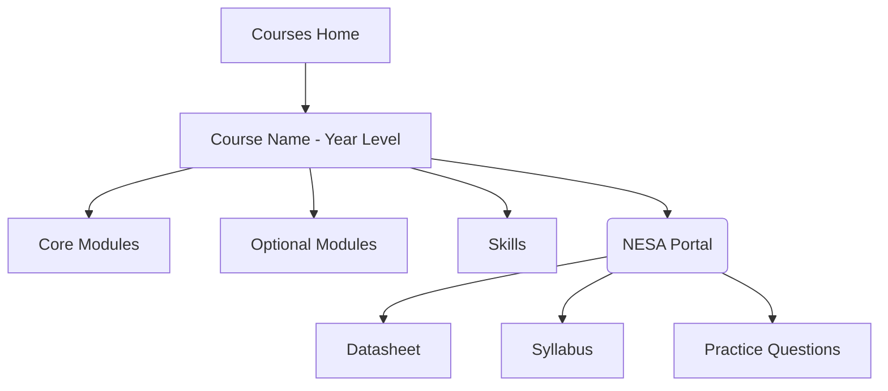



This site has been running for nearly 2 years now, but we've realised that our process for content publication and writing hasn't been as transparent as we originally planned. As a result, we decided to make this (not so) short explainer on how we create posts, where we source our information, and how reliable our content should be considered.

### Before we write

- Before we even start writing, the first port of call is the project board.
- We have a KanBan set up with all the subjects which we plan to write for in the near future, as well as our progress so far in each, and who is writing what.
- Once we pick a subject to start, we take a look at the syllabus for that subject, as well as the notes from the HSC marking centre for the last 2 years.
- We try to consult with teachers wherever possible to gain another perspective on which areas need the most focus and attention to detail.
- Once this is done, the planning process begins!

### Planning and Layout

- The flowchart above shows the structure of the courses section on the site.
- A good example of how this section works is the [HSC Chemistry course](/courses/chemistry-hsc/): 
  - At the top of the page are the module posts, in order, for the (currently 2 but soon to be 4) modules
  - Below this is the resources section, with useful pages such as the list of Polyatomic Ions, and the Chemistry Equations document
  - In the same section are resources from NESA, such as the datasheet, syllabus, and Additional Sample Questions. These resources are directly mirrored from NESA's IPFS storage, so they come through unmodified.
- Courses with optional modules, such as [HSC Modern History](/courses/modern-hsc/), always have Common Modules as the first priority, because this is the area which most students will be competing
- Optional modules, such as National Studies for Modern History, or Religious Depth Studies for [HSC Studies of Religion](/courses/sor-hsc/), are grouped by section below the common modules.

