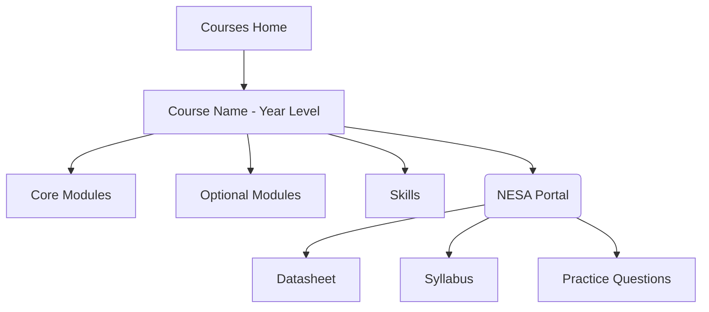



This site has been running for nearly 2 years now, but we've realised that our process for content publication and writing hasn't been as transparent as we originally planned. As a result, we decided to make this (not so) short explainer on how we create posts, where we source our information, and how reliable our content should be considered.

### Before we write

- Before we even start writing, the first port of call is the project board.
- We have a KanBan set up with all the subjects which we plan to write for in the near future, as well as our progress so far in each, and who is writing what.
- Once we pick a subject to start, we take a look at the syllabus for that subject, as well as the notes from the HSC marking centre for the last 2 years.
- We try to consult with teachers wherever possible to gain another perspective on which areas need the most focus and attention to detail.
- Once this is done, the planning process begins!

### Planning and Layout

- The flowchart above shows the structure of the courses section on the site.
- A good example of how this section works is the [HSC Chemistry course](/courses/chemistry-hsc/): 
  - At the top of the page are the module posts, in order, for the (currently 2 but soon to be 4) modules
  - Below this is the resources section, with useful pages such as the list of Polyatomic Ions, and the Chemistry Equations document
  - In the same section are resources from NESA, such as the datasheet, syllabus, and Additional Sample Questions. These resources are directly mirrored from NESA's IPFS storage, so they come through unmodified.
- Courses with optional modules, such as [HSC Modern History](/courses/modern-hsc/), always have Common Modules as the first priority, because this is the area which most students will be competing
- Optional modules, such as National Studies for Modern History, or Religious Depth Studies for [HSC Studies of Religion](/courses/sor-hsc/), are grouped by section below the common modules.

### Writing Process

- Posts always start with a table of contents if you view on a mobile device, or any portrait browser window. Otherwise, the table of contents appears on the right side of the screen.

- We try to stick to the syllabus order wherever possible, occasionally injecting revision sections for previous modules so that you don't need to hunt around if you've forgotten something.

- Content is written using the Cornell layout, which we'll explain in a future post. Essentially, it consists of taking a syllabus point, turning it into a question, and then answering the question. For example:

  > Preliminary Chemistry Syllabus Point: Model the atom’s discrete energy levels, including electronic configuration and spdf notation (ACSCH017, ACSCH018, ACSCH020, ACSCH022)

  - Becomes "How do scientists model the discrete energy levels of an atom?", which is then answered.

- We do this for each point of each module, adding additional information as we feel is needed (for example, terminology definitions, historical context, formulae, etc.)

- Once someone has finished writing the first draft of a post, it gets sent to another member of the team to look over.
  - This person isn't reviewing the accuracy of the content, they're reviewing whether the post makes sense. As a result, the first review is from someone who doesn't take the subject being written about.
  - This person is referred to as the 'comprehension reviewer'.
- If this draft gets approved, it gets sent to someone who has a good knowledge of the subject, and can contribute extra information and point out areas which have been missed.
  - This person is referred to as the 'knowledge reviewer'.
  - If you look at the Authors list of our posts since 2020, the first author is the actual writer, and the second is the knowledge reviewer.

- After this, the additions (if any) are sent back to the comprehension reviewer to check over, and the author adds any support material (Explainer videos, additional context links, etc.)

- Assuming a post survives all of that, it gets sent to the publishing pipeline.

### Publishing

- Up until this point, the post is in a Markdown format. This is really easy to read if you know how, but not very pretty or web-friendly.
- The publishing team (its not really a team, its usually just the author) takes the markdown and posts it to our internal Git repository
  - We use Git for version control, so that if something breaks, we can always roll back to a previous version of the site with minimal data loss, and also see who has made which changes.
- Once in our repository, the post automatically gets processed and uploaded to our edge servers. Global distribution occurs in about a minute on average.
- The next time you open the site, the new post will appear in the relevant subject for you to read and learn from.

And that's pretty much it! If you want to know more and/or want to get involved, feel free to message any of us on Instagram (find on our author pages), or send an email to [writers@hsc.one](mailto:writers@hsc.one).

Thanks for reading!

