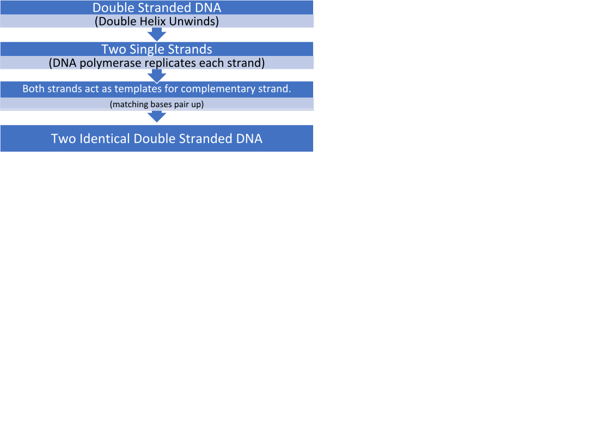



[Need to revise the preliminary course? Find it here.](/courses/biology-preliminary/)



**Asexual reproduction:** Requires only one parent. Parent cell replicates and divides to create genetically identical offspring.

**Sexual reproduction:** Requires two parents. Haploid gamete cell from each parent produces genetically unique offspring.

<table>
  <tr>
   <td>
   </td>
   <td>Disadvantages
   </td>
   <td>Advantages
   </td>
  </tr>
  <tr>
   <td>Sexual Reproduction
   </td>
   <td>-Energy costly.

- Requires 2 parents.

- Courtship is time and resource consuming.
   </td>
   <td>-High genetic diversity.

- Less prone to environmental change.
   </td>
  </tr>
  <tr>
   <td>Asexual Reproduction
   </td>
   <td>- Low genetic diversity.

- Prone to environmental change.
   </td>
   <td>-Energy efficient.

- Requires 1 parent.

- No courtship required.
   </td>
  </tr>
</table>

### Sexual reproduction in plants

Male:

*   Anther – produces pollen.
*   Filament – supports anther.

Female:

*   Stigma – sticky bulb that catches pollen (sex cells)
*   Style – passageway for pollen.
*   Ovary – holds the eggs awaiting fertilisation
*   Ovum – ‘small egg’ that grows into a seed after fertilisation.

### Sexual reproduction in animals

Haploid male and female gametes unite (fertilisation) producing genetically unique offspring.

### Asexual reproduction in animals

*   Budding – E.g coral. Bud comes off parent organism and eventually develops into a new branch, or it breaks off.
*   Regeneration/fragmentation – E.g starfish. Part of parent organism breaks off; it will regenerate to become new individual.
*   Parthenogenesis – E.g honeybees. Development of female gametes without fertilisation, ‘virgin birth’.

<table>
  <tr>
   <td>
   </td>
   <td>
Definition
   </td>
   <td>Disadvantages
   </td>
   <td>Advantages
   </td>
  </tr>
  <tr>
   <td>Internal Fertilisation
   </td>
   <td>Sperm and egg unite within female body.
   </td>
   <td>-Higher energy requirement to care for offspring.

- Less offspring produced.
   </td>
   <td>-Fertilisation more likely to occur.

- Offspring more likely to survive.

(protected from predators).
   </td>
  </tr>
  <tr>
   <td>External Fertilisation
   </td>
   <td>Sperm and egg unite outside female body.
   </td>
   <td>-Many gametes go unfertilised.

- Offspring often not protected.
   </td>
   <td>- Little energy required to mate.

- Large numbers of offspring produced.
   </td>
  </tr>
</table>

*   **Fungi** reproduce both sexually and asexually.

Commonly asexually, fungi reproduced through spores. Fungi sexually reproduce in adverse conditions, so genetic variation is ensured.

### Hormone control of pregnancy

Hormone – a chemical substance produced in the body, regulates activity of certain cells/organs.

There are two phases in the menstruation cycle;

*   Follicular phase, 1 – 14 days.
*   Luteal phase, 14-28 days.

Five hormones are involved in controlling pregnancy:

*   FSH – stimulates development of the egg.
*   LH – development of the ovum, involved in inducting ovulation. Stimulates estrogen and progesterone.
*   Progesterone – stimulates regrowth of uterine lining, inhibits release of FSH and LH.
*   Estrogen - improves the formation of blood vessels, transfers nutrients, and steadily increases during pregnancy. Reaches its peak in the third trimester. Rapid increase causes nausea with pregnancy.
*   Prolactin – hormone produced in pituitary glands, produces breastmilk and increases breast size. Prolactin levels increase 10 to 20 times, these levels stay high if the woman decides to breastfeed, if not the levels decrease.
*   Oxytocin aids delivery by helping the uterus contract.
*   Embryo – 2nd to 8th week after fertilisation.

- Fetus – more than 8 weeks after conception.

#### Binary fission

A method of asexual reproduction that causes a separation from the parent cell to create a new organism. The genetic material of the parent will duplicate, and then divide into two parts.

Produces genetically identical offspring (asexual reproduction).

#### Meiosis

_IIPMATC-PMATC_

*   Interphase I1: -Centrosomes duplicate.

- Chromosomes not visible.

*   Interphase I2: -Chromosomes duplicate, homologous pairs
*   Chromosomes visible.
*   Prophase I: -Meiotic spindle begins to form.
*   Nuclear envelope fragments.
*   Crossing over occurs (genetic recombination).

*   Metaphase I: Chromosomes line up in the middle of cell.
*   Centrosomes move to opposite poles of cell.

- Meiotic spindle attaches to centromere.
- Independent assortment occurs.

*   Anaphase I: - Chromosomes pull away to opposite poles of cell.
*   Telophase I: - Two nuclei are formed on opposite poles of cell, encasing chromosomes.
*   Cytokinesis I: -Cell divides.
*   Prophase II: -Meiotic spindle forms.
*   Nuclear envelope fragments.
*   Centrosomes duplicate.

*   Metaphase II: Homologous pairs line up in middle of cell.
*   Centrosomes move to opposite poles of cell.
*   Meiotic spindle attaches to centromeres.

*   Anaphase II: - Chromatids are pulled to opposite poles of the cell.
*   Telophase II: - Two nuclei are formed on opposite poles of cell, encasing chromatids.
*   Cytokinesis II: - Four genetically unique haploid (n) sex cells formed.

#### Mitosis - IPMATC

Interphase – centrosomes duplicate, chromosomes duplicate (not visible)

Prophase – nuclear envelope fragments, meiotic spindle begins to form, chromosomes visible.

Metaphase – chromosomes line up in middle of cell, meiotic spindle attach.

Anaphase – chromatids pulled apart to opposite poles of cell.

Telophase – two nuclei are formed opposite poles of cell.

Cytokinesis – cell divides creating two genetically identical cells.

**DNA Replication Flow Chart**

DNA Polymerase is an enzyme that causes nucleotides to form a complimentary DNA strand.

<table>
  <tr>
   <td>DNA in Eukaryotes
   </td>
   <td>DNA in Prokaryotes
   </td>
  </tr>
  <tr>
   <td>- The DNA of eukaryotes is found in the nucleus of the cell.

- The DNA is found inside chromosomes.

- Chromosomes are linear in shape.

- The DNA is coiled around proteins called histones.
   </td>
   <td>-The DNA in prokaryotes aren’t bound with proteins.

- Circular in shape.

- Found freely in cytoplasm.

- Contains extra-chromosomal plasmids which can replicate independently. (double-stranded DNA molecules)
   </td>
  </tr>
</table>

**Histones:** DNA packaging proteins.

### Polypeptide Synthesis

**1 -** Transcription.

- RNA polymerase binds to a part of the DNA and causes the DNA to unzip.

- Information is copied into a new molecule of messenger (mRNA).

- Thymine is replaced with uracil, nitrogen bases A, G, C remain unchanged.

- mRNA will move into the cytoplasm and translation will occur.

**2– Translation**.

- The mRNA will translate into a series of amino acids based upon its codon, which is a pair of three nucleotides.

- A tRNA molecule with an anti-codon sequence will match up with its corresponding codon to deliver the right amino acid.

- The amino acids delivered by the tRNA will become linked by peptide bonds, creating peptides.

- Proteins are made up of polypeptide chains, and polypeptides are made of peptides made by these amino acids.

**tRNA:** A small RNA molecule that carries an amino acid and anti-codon sequence.

**Codominance:** Two alleles are present, but neither one is dominant so both are expressed.

*   Roan cow, both red and white are expressed, blotches of red and white.

**Incomplete dominance:** Neither allele is dominant. Neither allele is 100% expressed. You get a blending of traits.

*   White and red flower creates completely new phenotype (pink).

#### Multiple Alleles

Blood type is an example of multiple alleles because there are three alleles. A, B and O.

*   Red blood cells have different surface antigens – A, B, AB or O. E.g. type A blood cells have A antigens on their surface. **O does** **not have** any A or B antigens on its surface, consider it ‘naked’. O can give to anyone, but can only receive from blood type O.
*   The O gene is recessive. Can only be ii.

**Autosomal:** Trait is not on a sex chromosome (X or Y).

*   Can be autosomal recessive, or autosomal dominant.



Found this post useful? [Support us on Patreon.](https://patreon.com/schoolnotes)

