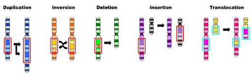



[Need to revise the preliminary course? Find it here.](/post/biology-prelim-complete/)



Nucleotides are composed of three molecules:

Phosphate – Deoxyribose sugar – Nitrogen base (A, T, G, C)

**Enzymes** speed up chemical reactions by lowering the required energy.

*   Example catalase, found in liver.

**Genotype** is the combination of alleles for a trait.

**Phenotype** is the physical expression of a trait.

**Mutation**: a permanent change in the nucleotide sequence in DNA.

They can be harmful, beneficial or neutral.

*   SNP – Single Point Mutation – substitution of a single nucleotide.
*   Silent mutation – substitution of a single nucleotide and still codes for the same amino acid.
*   Nonsense mutation – substitution of a single nucleotide which results in a stop codon. _Commonly causes non-functional protein._
*   Missense mutation – substitution of a single nucleotide which results in a different amino acid. _Commonly causes non-functional protein. (e.g. sickle cell anaemia)_
*   Deletion – when one or more nucleotides delete resulting in a frameshift mutation.
*   Insertion – the addition of a nucleotide which results in a frameshift mutation, unless an entire codon is added which is unlikely.

### Chromosomal Mutations

1.  Deletion – One region of a chromosome is removed, **reduces number of genes.**
2.  Insertion – Part of the DNA is duplicated and inserted into a homologous chromosome. **Location is important, if it is an exon, it is more likely to have a phenotypic effect than an intron would.**
3.  Inversion – One region of a chromosome is flipped 180 degrees and reinserted. **This gene will read back to front, big problems e.g. Haemophilia.**
4.  Translocation – A region from one chromosome is removed and added to another which is not its homologous. **Can lead to gene fusion.**
5.  Aneuploidy – Changes in chromosome number. One or more extra copies of an entire chromosome, or an entire chromosome is missing. **E.g. Down Syndrome, Trisomy 21.**

Chromosomal mutations occur in meiosis. They occur in either crossing over, or in independent assortment.

**DNA Sequencing:** Determines the precise order of nucleotides within a segment of DNA. It is not a specific technology; it is any technology that can do this.

**DNA profiling:** Analysis of STR’s, Short Tandem Repeats. Found in DNA.

The more similar an individual’s STR’s are to another person, the more related they are.

**Gel Electrophoresis:** Used in DNA profiling. Separates large molecules at different sizes e.g. proteins + DNA.

**Polymerase Chain Reaction (PCR)** Amplifies genes or DNA. With a small sample, the DNA polymerase (an enzyme) can make new copies of the DNA.

_This occurs from first denaturing, second annealing, third elongating._

### How does UV light cause mutation?

Too much UV light can kill skin cells by damaging their DNA. If enough DNA damaged builds up, it can cause cells to start growing out of control. This can result in the non-infectious environmental disease melanoma.

### How do cigarettes cause mutation?

There are thousands of chemicals in a cigarette, and 60 of them are carcinogens. Carcinogens contribute to the formation of cancer.

These carcinogenic chemicals are absorbed into the blood and results in the cells mutating. This is what results in the formation of cancer.

**Artificial Insemination:** The process where sperm from a male with desirable traits is artificially inseminated to a female.

<table>
  <tr>
   <td>Advantages
   </td>
   <td>Disadvantages
   </td>
  </tr>
  <tr>
   <td>
<ul><li>Transport of semen is easier than transporting a whole animal.
<li>Semen can be stored for long periods.
</li>
</ul>
   </td>
   <td>

<ul><li>Cannot guarantee favourable traits will be passed on.
<li>Reduced genetic variation results in population susceptible to environmental change.
</li>
</ul>
   </td>
  </tr>
</table>

**Selective breeding:** The intentional mating of individuals with desirable traits, in the hope the desired traits will be in the phenotype of the offspring.

(Past Biotechnology)

**Artificial Pollination:** The process where pollen from a plant with desirable traits is artificially transferred to the female stigma of another plant.

Stigmas are removed from female plant to avoid self-pollination.

**Organism Cloning:**

The process by which genetically identical copies of an organism have been made without any type of reproduction.

<table>
  <tr>
   <td>Advantages
   </td>
   <td>Disadvantages
   </td>
  </tr>
  <tr>
   <td>-Guaranteed to express desired trait.

-Cloned plants have identical requirements.
   </td>
   <td>-Offspring are susceptible to environment change.
   </td>
  </tr>
</table>

**Transgenesis:** The process by which a gene is removed from one species and inserted into the genome of another species.

*   The organism’s genome will be amplified using PCR, and the desired gene will be separated from the DNA of that organism by using a restriction enzyme. The gene would then be inserted into a bacterial plasmid, upon which the plasmid would then be reinserted into a bacterium. Every time that bacteria undergoes cell division, it would create a copy of that gene (gene cloning).

**This process can be used for the production of human insulin.**

**Transgenic organism:** An organism that contains genes from a different species inserted into its genome. For example, **Bt. Cotton.**

*   Regular cotton was attacked by a pest (the bollworm) that eats the bud. In response, farmers used insecticides that resulted in killing all insects, including bees and ants. Bt. Cotton is a transgenic organism that has a certain gene inserted into its genome from the bacteria (Bt). This gene can produce a toxin that kills the bollworm, hence protecting the crop.

**Gene:** A section of DNA which contains instructions for proteins.

**Future Biotechnology:** CRISPR.

CRISPR _(Clustered Regularly Interspaced Short Palindromic Repeats) _is a genome editing technique. **It is a defense system for bacteria.** If the DNA of an invading virus entered the cell, the enzyme (CRISPR) would chop off the DNA. Genes can now be spliced and inserted with immense accuracy.

<table>
  <tr>
   <td>Introns
   </td>
   <td>Exons
   </td>
  </tr>
  <tr>
   <td>
<ul>

<li>Sections of mRNA that do not code for proteins.

<li>Removed from the strand of pre-mRNA.

<li>Broken down and recycled.
</li>
</ul>
   </td>
   <td>
<ul>

<li>Sections of mRNA which become “expressed” or translated into a protein.

<li>Once introns are removed the exons are spliced with other exons to create a chain of mature mRNA.

<li>Mature mRNA moves into ribosome where instructions are translated into a protein.
</li>
</ul>
   </td>
  </tr>
</table>

<table>
  <tr>
   <td>Somatic Mutations
   </td>
   <td>Germ-line Mutations
   </td>
  </tr>
  <tr>
   <td>
<ul>

<li>Genetic mutation in somatic cells.
</li>
</ul>
   </td>
   <td>
<ul>

<li>Genetic mutation that occurs in the sex cells.

<li>For example, a non-disjunction. The failure of chromosomes to separate in meiosis anaphase that result in aneuploidy (missing or extra chromosome). E.g. Down Syndrome, Trisomy 21.
</li>
</ul>
   </td>
  </tr>
</table>

### Population Genetics

*   **Genetic drift** – changes in allele frequency due to random change. E.g. A person accidentally steps on most of the green beetle population.
*   **Gene flow** – transfer of genetic information from one population to another.
*   **Bottleneck effect** – significant reduction of a population, results in reduced genetic variation. E.g. Cheetah, resulted in inbreeding. Reduced genetic variation.



Found this post useful? [Support us on Patreon.](https://patreon.com/schoolnotes)

