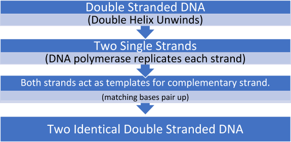



[Need to revise the preliminary course? Find it here.](/courses/biology-preliminary/)



**Homeostasis:** The maintaining of a stable internal state despite changes in the world outside. Maintained by both nervous system and endocrine system.

**Stimulus response**: When a change (e.g. touching something hot) is detected by a receptor e.g. cell or organ which then the receptor communicates with an **effector** which produces a response.

*   The message that is sent by a receptor (for something hot) travels to the effector which initiates a response.

**Endotherm:** Capable of producing their own body heat.

**Ectotherm:** Relies on the regulation of body heat by external sources.

**Temperature Negative Feedback Loop:**

Temperature is measured by the hypothalamus, and is kept at 36.7 degrees.

Temperature is regulated by physiological and behavioural negative feedback loops.

Example: Physiological

As a response to a **decrease in body temperature**, the body shivers creating warmth by expending energy.

*   As a response to an **increase in body temperature**, the body sweats which expends heat as it evaporates.

Example: Behavioural 

-If the hypothalamus detects high body temperature, as a behavioural reaction that person would feel the need to enter the shade.

-If the hypothalamus detects low body temperature, as a behavioural reaction that person would feel the need to move into the sun.

**Glucose Negative Feedback Loop:**

*   The pancreas produces insulin and glucagon.
*   The liver responds to insulin and glucagon.

-**Insulin** stimulates the liver to absorb glucose from the blood, lowering blood glucose concentration. It is then stored as **glycogen.**

(Insulin is a hormone, produced and regulated by beta cells in the pancreas)

-**Glucagon** stimulates the liver to convert stored glycogen into glucose and release it into the blood, raising blood glucose concentration.

(Glucagon is a hormone that counteracts the actions of insulin and is secreted by alpha cells).

### Homeothermy

Maintenance of a stable internal body temperature.

**Structural** adaptations for Homeothermy:

*   A large or small surface area to volume ratio. Larger animals are found in the cold because they have a smaller surface area to volume ratio, which means not a lot of heat is lost. Smaller animals are abundant to hotter areas because they have a larger surface area to volume ratio, which means lots of heat is lost through the skin.
*   Insulation means that heat cannot easily be lost. Whales have a fat layer of blubber that does this.

**Physiological** adaptations for Homeothermy:

*   Counter-current flow. For example, in a killer whale’s tongue, veins and arteries run alongside each other so any heat loss due to the cold water is not actually lost, it is absorbed by the other blood vessel.

**The Nervous System:**

Delivers specific messages to a target cell rapidly. This message is carried by neurons/nerve cells.

Each nerve is a bundle of nerve cells, also called neurons.

Nervous messages are called ‘nerve impulses’, and move as a wave of electrical depolarisation.

*   Opening of membrane channels allows the movement of sodium ions through the cell membrane. This temporarily changes the electrical charge inside the neuron from negative to positive, allowing information to be transferred along the neuron.

### The Hormonal System (Endocrine System)

Delivers messages slowly and generally. This message is carried by hormones.

**Hormones** are produced in endocrine glands. Secreted directly into blood stream.

Hormones are specific and causes a response in specific organs/groups of cells.

*   They reach all cells in the body, but because e.g. the brain does not have a receptor for a glucagon hormone, it does not have an effect on the cell. On the other hand, liver cells do have a protein receptor for glucagon, which results in a change in interactions inside the cell.

#### Reflex Arcs

*   Some nervous messages do not need the brains response for appropriate action, such as when touching something hot we pull our hand away. This means a response will be much faster meaning less damage will be caused.
*   In a reflex arc the message will travel to the spinal cord along a sensory neurone, and then pass through an interneuron which will relay the message to a motor neuron, which will stimulate the response.

#### Maintaining Water Balance in Plants

Stomata are pores on the leaf which allow the exchange of carbon dioxide and oxygen. To maintain water-balance a plant can have:

1. **Curled leaves**. This results in the stomata being surrounded by humid air, instead of dry. Concentration gradient of water vapour is reduced, reducing the rate of evaporation.
2. **Sunken stomates**. The stomata are located deep in the epidermis, which increases humidity and prevents further transpiration.

**How the stomata work:**

The stomates open in times of high-water levels, when the internal water levels are low, the stomates close.

*   The guard cells surrounding the stomates aid in the exchange of carbon dioxide and oxygen as flaccid guard cells help close the stomate, turgid guard cells help open the stomates.

### Genetics

*   **Genetic Disease** – any condition caused by an abnormality in the genome, which impairs the normal functioning of the body or one of its parts.
*   **Chromosomal Abnormalities** – these include disorders caused by chromosomal number mutations, named aneuploidy (extra or missing chromosomes). E.g. Trisomy-21, or Down Syndrome
*   **Structural chromosomal mutations** – e.g. translocations, deletions, duplications of part of a chromosome.
*   **Environmental disease** – caused by factors in the environment other than pathogens. For example, chemical exposure (smoking) or radiation (UV rays).

**How does hearing loss occur?** Hearing loss is a problem with the mechanical conduction of vibrations. It can occur from:

*   Infection.
*   Excessive noise exposure.
*   Malformation at birth. Ear drum not formed properly.

Damage of auditory nerve is usually permanent.

Hearing loss can be fixed by:

*   Cochlear implants – A sound processor is placed on the skull which capture sound and sends electrical signals to the inner ear. In the inner ear is an implant which will pick up the signals sent from the sound processor and will stimulate the nerve fibres. The nerve signals then travel to the brain and register as normal hearing.
*   Bone conduction implants – A microphone is placed on the skull and transforms sound into vibrations that pass through the bone into the cochlea. The vibrations are then processed by the cochlea into normal hearing.
*   Hearing aids – Amplifies sound to make it louder, more likely for the sound wave to reach the inner ear.

**Melanoma - Non-Infectious Disease – Environmental Exposure**

<table>
  <tr>
   <td>Prevention
   </td>
   <td>Treatment
   </td>
   <td>Future Directions
   </td>
  </tr>
  <tr>
   <td>-Wearing sunscreen.

-Non-excessive amount of UV light (sunlight).

-Covering up, wearing a hat, long sleeve-shirt.
   </td>
   <td>-Surgery, not entirely efficient for metastasised cancers as cancer will still be present throughout the body.

-Chemotherapy, drugs are taken that attack cancer cells.

-Radiation therapy, use of high-powered energy beams to kill cancers.
   </td>
   <td>-Nanotechnology is a possible future direction for the treatment of cancers. Nanotechnology if available would activate multiple parts of the immune system to fight cancer, and more specifically melanoma.
   </td>
  </tr>
</table>

## Epidemiological Study: ‘Doll and Hill’

Epidemiological studies discuss the association between a suspected risk factor and disease. These studies measure health status among a population, and help us identify the major causes for a certain risk.

For example, the ‘Doll and Hill’ study identified that cigarettes have a direct correlation to lung cancer. Numerous people were interviewed in this case-controlled study, one group being those with lung cancer, another being without lung cancer.

*   The one consistent difference between the two groups was that the cancer patients were more frequent, heavier smokers compared to the non-cancer control group.

**Visual Disorders**

**Myopia** is the inability to see things unless there are close to your eyes.

When light enters a normal eye, it is bent by the cornea and the lens, which results in the light hitting the centre of the retina in the back of the eye.

In a near-sighted eye (myopia), the eye grows too long which causes the focal point to stop in front of the retina. This results in distance objects becoming blurry.

*   Myopia can be caused from family genetics.
*   Focusing of the eyes up close for extended periods is also a cause of myopia.

Myopia can be assisted by using a **concave contact lens**. Due to the cornea being curved too much, a concave lens is placed in front of the eye that adjusts the focal point back to the centre of the retina.

Myopia can also be assisted using laser surgery (LASIK).

LASIK uses lasers to reshape the cornea on your eye for the optimal curvature.

One laser will open a thin flap on the surface of the cornea, and another to reshape the cornea underneath.

**Loss of Kidney Function** occurs gradually, it does not occur ‘instantaneously’.

It can occur from high blood pressure, physical injury, diabetes, or other disorders.

The kidneys **remove wastes** such as urea from your blood using tiny filters called **nephrons**, consisting of **small blood capillaries**. Urea removed from the blood is then passed through the renal tubules to the bladder.

They kidneys ultimately act as a very efficient filtration system.

There are two treatments for **kidney failure.**

*   **Kidney transplant.** A kidney will be donated by a living or deceased individual and will be replaced with your non-functional kidney.
*   A **disadvantage** to a kidney transplant is **infection**, which could be life-threatening.
*   **Kidney dialysis.** A dialysis machine will remove waste and extra fluids from the blood and help to maintain blood pressure. The most common type of dialysis is **haemodialysis**, which will act as an artificial kidney.
*   Blood will be pumped through the machine, **fresh dialysate** will be pumped into the blood and **used dialysate** will be taken out (containing waste products e.g. urea).
*   A **disadvantage** to dialysis is that it is **not time efficient**. Patients will have to use the dialysis machine for a few hours a few times a week, which will cause some disruption to people’s schedules.



Found this post useful? [Support us on Patreon.](https://patreon.com/hscone/)

