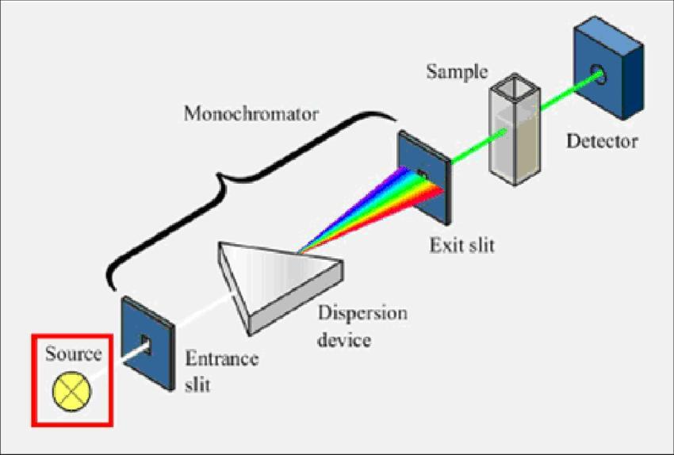

ENTHALPY CHANGE 
---------------

**Enthalpy (H)** is a measure of the heat content of a system. Absolute
enthalpy cannot be measured. However, the **change in enthalpy**
**(**∆**H)**: the change in the heat content of system during a process,
measured at **constant pressure**.

> $Δ𝐻 = 𝐻_{𝑝𝑟𝑜𝑑𝑢𝑐𝑡𝑠} − 𝐻_{𝑟𝑒𝑎𝑐𝑡𝑎𝑛𝑡𝑠}$

-   𝐻~𝑝𝑟𝑜𝑑𝑢𝑐𝑡𝑠~ \< 𝐻~𝑟𝑒𝑎𝑐𝑡𝑎𝑛𝑡𝑠~, therefore Δ𝐻 is **negative** and heat
    energy **released** by the system (**exothermic**).

-   𝐻~𝑝𝑟𝑜𝑑𝑢𝑐𝑡𝑠~ \> 𝐻~𝑟𝑒𝑎𝑐𝑡𝑎𝑛𝑡𝑠~, therefore Δ𝐻 is **positive** and heat
    energy **absorbed** by the system (**endothermic**).

### ENERGY PROFILE DIAGRAMS 

HESS'S LAW OF HEAT SUMMATION 
----------------------------

'*The total enthalpy change in a chemical reaction is **constant**,
whether the reaction is performed in **one step** or **several
steps.**'*

Hess's law is a form of the **law of conversation of energy** (First law
of Thermodynamics).

> 

BOND ENERGIES 
-------------

Bond energy (or bond enthalpy) is the amount of energy required to
**break** **one mole** of a bond in a **gaseous molecule**.

$\Delta 𝐻_{𝑟𝑥𝑛} = ∑ ∆𝐻_{\text{𝑟𝑒𝑎𝑐𝑡𝑎𝑛𝑡 𝑏𝑜𝑛𝑑𝑠 𝑏𝑟𝑜𝑘𝑒𝑛}} + ∑∆𝐻_{\text{𝑝𝑟𝑜𝑑𝑢𝑐𝑡 𝑏𝑜𝑛𝑑𝑠 𝑓𝑜𝑟𝑚𝑒𝑑}}$

$∆𝐻_{𝑟𝑥𝑛} = ∑∆𝐻_{\text{𝑏𝑜𝑛𝑑 𝑒𝑛𝑡ℎ𝑎𝑙𝑝𝑦 𝑜𝑓 𝑟𝑒𝑎𝑐𝑡𝑎𝑛𝑡𝑠}} − ∑∆𝐻_{\text{𝑏𝑜𝑛𝑑 𝑒𝑛𝑡ℎ𝑎𝑙𝑝𝑦 𝑜𝑓 𝑝𝑟𝑜𝑑𝑢𝑐𝑡𝑠}}$

 ENTROPY 
-------

**Entropy (S)** is a measure of how **the available energy is
distributed or dispersed** amount particles in a system. It is also a
measure of energy dispersal (function of temperature). Generally, low
entropy → high entropy. (Chaos)

When energy can be **distributed in more ways,** there is a greater
entropy

-   Entropy is sometimes referred to as the measure of **disorder** or
    **randomness**.

-   A system with **greater possible arrangements (microstates Ω)**, or
    **greater diversity of movement** has higher entropy.

### FACTORS THAT CHANGE ENTROPY 

-   Increasing the **number of particles** → Increases microstates →
    **Increase** entropy

-   **Mixing** different types of particles → Increases microstates →
    **Increase** entropy

-   Increasing the **volume** of a container of gas → Increases
    microstates → **Increases** entropy o the larger the volume, the
    more ways there are to distribute the energy

-   Increasing the number of particles in **states with more freedom of
    movement** (gas \> liquid \> solid)

-   Molecules becoming **more complex** → Increases microstates →
    **Increases** entropy

-   Increase **temperature** → Increases microstates → **Increases**
    entropy

SECOND LAW OF THERMODYNAMICS 
----------------------------

The second law of thermodynamics states that the **entropy of the
universe is always increasing**.

> $Δ𝑆_{𝑢𝑛𝑖𝑣𝑒𝑟𝑠𝑒} = Δ𝑆_{𝑠𝑦𝑠𝑡𝑒𝑚} + Δ𝑆_{𝑠𝑢𝑟𝑟𝑜𝑢𝑛𝑑𝑖𝑛𝑔𝑠} \gt 0$

### CALCULATING ENTROPY IN CHEMICAL REACTIONS 

> $Δ𝑆_{𝑟𝑥𝑛} = ∑ Δ𝑆_{𝑝𝑟𝑜𝑑𝑢𝑐𝑡𝑠} − ∑Δ𝑆_{𝑟𝑒𝑎𝑐𝑡𝑎𝑛𝑡𝑠}$

GIBBS FREE ENERGY 
-----------------

In any process, the main form of interaction between the **system** and
the **surroundings** is the **exchange of heat**.

-   In an **exothermic** reaction, heat from the system **enters** the
    surrounding and **increases temperature**, which will **increase**
    its **entropy.** The reverse will be true for an endothermic
    reaction.

-   At a lower temperature, the same amount of heat will cause a greater
    proportional change in entropy.

> $Δ𝑆_{𝑢𝑛𝑖𝑣𝑒𝑟𝑠𝑒} = Δ𝑆_{𝑠𝑦𝑠𝑡𝑒𝑚} + Δ𝑆_{𝑠𝑢𝑟𝑟𝑜𝑢𝑛𝑑𝑖𝑛𝑔𝑠} \gt 0$
>
> 
>
> $Δ𝑆_{𝑠𝑢𝑟𝑟𝑜𝑢𝑛𝑑𝑖𝑛𝑔𝑠 }= \frac{−Δ𝐻_{𝑠𝑦𝑠𝑡𝑒𝑚}}{𝑇}$
>
> 
>
> $Δ𝑆_{𝑢𝑛𝑖𝑣𝑒𝑟𝑠𝑒} = Δ𝑆_{𝑠𝑦𝑠𝑡𝑒𝑚} - \frac{−Δ𝐻_{𝑠𝑦𝑠𝑡𝑒𝑚}}{𝑇} \gt 0$
>
> 
>
> $−𝑇Δ𝑆_{𝑢𝑛𝑖𝑣𝑒𝑟𝑠𝑒} = Δ𝐻_{𝑠𝑦𝑠𝑡𝑒𝑚} − 𝑇Δ𝑆_{𝑠𝑦𝑠𝑡𝑒𝑚} \lt 0$

**Josiah Willard Gibbs** redefined the quantity −𝑇Δ𝑆~𝑢𝑛𝑖𝑣𝑒𝑟𝑠𝑒~ as **free
energy** or **Gibbs Free Energy,** 𝚫𝑮**.**

> $Δ𝐺_{𝑠𝑦𝑠𝑡𝑒𝑚} = Δ𝐻_{𝑠𝑦𝑠𝑡𝑒𝑚} − 𝑇Δ𝑆_{𝑠𝑦𝑠𝑡𝑒𝑚}$

The equation allows the **comparison between the relative
contributions** of the two driving forces for a reaction, entropy and
enthalpy.

-   If 𝚫𝑮 \< 𝟎 (Δ𝐻~𝑠𝑦𝑠𝑡𝑒𝑚~ \< 𝑇Δ𝑆~𝑠𝑦𝑠𝑡𝑒𝑚~), a reaction is
    **spontaneous**

-   If 𝚫𝑮 \> 𝟎 (Δ𝐻~𝑠𝑦𝑠𝑡𝑒𝑚~ \> 𝑇Δ𝑆~𝑠𝑦𝑠𝑡𝑒𝑚~), a reaction is
    **non-spontaneous**

-   If 𝚫𝑮 = 𝟎, a reaction will occur both in the forward and reverse
    directions, **equilibrium**.

> 

EQUATION SUMMARY 
----------------

> 𝑞 = 𝑚𝑐Δ𝑇
>
> $Δ𝐻 = 𝐻_{𝑝𝑟𝑜𝑑𝑢𝑐𝑡𝑠} − 𝐻_{𝑟𝑒𝑎𝑐𝑡𝑎𝑛𝑡𝑠}$
>
> 
>
> $∆𝐻_{𝐶𝑜𝑚𝑏𝑢𝑠𝑡𝑖𝑜𝑛}= − \frac{q}{𝑛}$
>
> 
>
> $∆𝐻_{𝑆𝑜𝑙𝑛} = −\frac{q}{n}$
>
> 
>
> $∆𝐻_{𝑟𝑥𝑛} = ∑∆𝐻_{\text{𝑏𝑜𝑛𝑑 𝑒𝑛𝑡ℎ𝑎𝑙𝑝𝑦 𝑜𝑓 𝑟𝑒𝑎𝑐𝑡𝑎𝑛𝑡𝑠}} − ∑∆𝐻_{\text{𝑏𝑜𝑛𝑑 𝑒𝑛𝑡ℎ𝑎𝑙𝑝𝑦 𝑜𝑓 𝑝𝑟𝑜𝑑𝑢𝑐𝑡𝑠}}$
>
> $Δ𝑆_{𝑟𝑥𝑛} = ∑ Δ𝑆_{𝑝𝑟𝑜𝑑𝑢𝑐𝑡𝑠} − ∑Δ𝑆_{𝑟𝑒𝑎𝑐𝑡𝑎𝑛𝑡𝑠}$
>
> $Δ𝐺_{𝑠𝑦𝑠𝑡𝑒𝑚} = Δ𝐻_{𝑠𝑦𝑠𝑡𝑒𝑚} − 𝑇Δ𝑆_{𝑠𝑦𝑠𝑡𝑒𝑚}$

REVERSIBLE REACTIONS 
--------------------

### OUTCOMES COVERED 

-   model static and dynamic equilibrium and analyse the differences
    between open and closed systems

> (ACSCH079, ACSCH091)

-   investigate the relationship between collision theory and reaction
    rate in order to analyse chemical equilibrium reactions (ACSCH070,
    ACSCH094)
    
-   explain the overall observations about equilibrium in terms of the
    collision theory (ACSCH094)

EQUILIBRIUM 
-----------

For reversible reactions, a **reversible arrow** is used to indicate
that both reactions are capable of proceeding.

> **Reactants** ⇋ **Products**

**Physical changes** are generally reversible

### STATIC AND DYNAMIC EQUILIBRIUM 

Reactions will proceed until either a **static** or **dynamic
equilibrium** is reached. Equilibrium refers to the state of a **closed
chemical system** which:

1)  The **concentrations** of both reactant and products **do not
    change** with time

2)  The **rate** of the forward reaction is **equal** to the rate of the
    reverse reaction

**Irreversible reactions** (shown with a forward arrow →) that go to
completion reach a **static equilibrium**.

**Reversible reactions** (shown with a reversible arrow ⇋) do not go to
completion. In a closed system, reversible reactions will instead reach
a state known as **dynamic equilibrium**.

-   At equilibrium, the rates of the **forward** and **reverse
    reactions** are the **same**, but **non-zero.**

-   The equilibrium is dynamic because there are **changes occurring**
    at the **microscopic level**, even though the system undergoes **no
    change** at the **macroscopic level**.

There are no **macroscopic changes** when a closed system is at
equilibrium.

#### Types of Systems

-   An **open system** is a system where matter and energy **can**
    **enter** and **leave**.

-   A **closed system** is a system where matter cannot enter and leave,
    but energy exchange can take place with the surrounding (in the form
    of pressure or heat).

-   An **isolated system** is a system where neither matter nor energy
    can leave.

#### Rates of Reaction

1)  Concentration or Volume/Pressure

2)  Surface Area

3)  Temperature

4)  Presence of catalyst

5)  Reactivity of reactants

COLLISION THEORY 
----------------

In order for any reaction to proceed, reactants must collide. Particles
need to collide with sufficient energy and in the correct orientation
for it to be a successful reaction. A collision with sufficient energy
and the correct orientation is called an effective collision.

The rate of reaction is how rapidly a reaction proceeds. The rate is
defined as the change in the concentration of reactants or products over
time. It is dependent on the frequency of effective collisions.

### ADDITION/REMOVAL OF A REACTION COMPONENT 

If the concentration of one reaction component increases, its rate of
reaction will increase as there are more particles to collide with, thus
increasing the frequency of effective collisions. The rate of that
reaction will be relatively greater than that of the rate of the reverse
reaction. This means that more products or reactants will being produced
until equilibrium is reached.

Similarly, the reduction in one of the reaction components will reduce
its rate of reaction. This occurs as there are fewer particles to
collide with which reduces the frequency of effective collisions. The
rate of that reaction will be relatively less than the rate of the
reverse reaction. This means that more products or reactants will being
produced until equilibrium is reached.

### CHANGE IN VOLUME OR PRESSURE 

A decrease in the volume of a chemical system involving gasses will
result in gasses colliding more often. The gas particles will also be
colliding with more energy as pressure is inversely proportional to
volume. As particles are colliding more frequently and with more energy
to overcome the activation energy barrier, the frequency of effective
collision increases. Both the rate of the forward and reverse reaction
will increase, however, the rate of reaction that uses the greatest
number of moles will be relatively greater than the reverse reaction as
there are more particles that can collide effectively with each other.

When the volume is increased and pressure is decreased, the partial
pressures of all gasses will decrease. Both the rate of the forward and
reverse reaction will decrease. The rate of reaction that produces more
moles will be relatively greater than the reverse as the reaction is
more likely to occur because it requires fewer particles to effectively
collide.

Changing the overall pressure of a chemical system does not always cause
a disturbance in equilibrium. For example, the addition of inert gasses.

### CHANGE IN TEMPERATURE 

By increasing the temperature of a chemical system at equilibrium,
particles will possess more kinetic energy, which means that more
particles (both reactants and products) have enough energy to collide
and overcome the activation energy of the forward and reverse reactions.

For an exothermic reaction, the activation energy of the reverse
reaction is higher than that of the forward reaction. An increase in
temperature means that proportionally more products will be able to
collide with enough energy in reverse reaction than the reactants. This
causes the rate of the reverse reaction to occur at a faster rate than
the forward reaction. Therefore, the concentrations of the reactants
will increase whereas the concentration of the products will decrease
until a new state of equilibrium is reached.

When the temperature is decreased, all the particles in the system lose
energy which decreases both the rate of the forward and the reverse
reaction. However, the rate of the reverse endothermic reaction will be
relatively higher than the rate of the forward reaction.

#### OUTCOMES COVERED 

> - analyse examples of non-equilibrium systems in terms of the effect
>   of entropy and enthalpy.

PHOTOSYNTHESIS 
--------------

Photosynthesis appears to be the **reverse** reaction of the combustion of glucose and may seem to be a reversible reaction. However, in nature, the process involves many individual irreversible steps which combine to give the overall reaction; hence photosynthesis is irreversible.

> $\color{green}{\ce{6CO2(g) + 6H2O(l) → C6H12O6(s) + 6O2(g)}}$

-   $∆𝐻 \gt 0$ (endothermic)
-   $∆𝑆 \gt 0$ (less moles, moving to more order)
-   Non-spontaneous at all temperatures 
-   Chlorophyll is the catalyst for photosynthesis.
-   UV rays drive the photosynthesis reaction.

SPONTANEITY AND EQUILIBRIUM 
---------------------------

### Haber Process

$\color{orange}{\ce{N2(g) + 3H2(g) ⇋ 2NH3(g)}, ∆𝐺 = −33.3 𝑘𝐽𝑚𝑜𝑙^{−1}}$

-   The Gibbs free energy change for this reaction is negative,
    therefore we would predict that the **forward reaction is
    spontaneous.**

-   The Gibbs free energy change for the reverse reaction will be the
    negative of this value, $+33.3 𝑘𝐽𝑚𝑜𝑙^{−1}$, so we would predict that
    the **reverse reaction is nonspontaneous.**

-   **Entropy of mixing** allows the reaction to be reversible.

-   The position with **lowest free energy** is somewhere **in between
    pure reactants and pure products.** This is the position of
    equilibrium.

The sign of $∆𝐺$ indicates whether **reactants** or **products** will
**dominate the mixture** with lowest free energy.

-   Since entropy of mixing always exist, **technically no reaction is
    strictly irreversible.** However, if the position of equilibrium
    lies very close to the products, the reaction is called
    "irreversible" as the reverse reaction will not occur to **any
    observable extent**.

>  This is when Gibbs free energy is **very negative**.

-   Reversibility of a reaction can also be considered in terms of
    **activation energy**. Reactions are unlikely to be reversible as
    molecules will not have sufficient energy.

> in order for a reaction to be reversible, the forward and reverse
> reaction must have a **small activation energy**.

LE CHATELIER'S PRINCIPLE 
------------------------

### OUTCOMES COVERED 

> investigate the effects of temperature, concentration, volume and/or
> pressure on a system at equilibrium and explain how Le Chatelier's
> principle can be used to predict such effects, for example:

-   heating cobalt(II) chloride hydrate

-   interaction between nitrogen dioxide and dinitrogen tetroxide

-   iron(III) thiocyanate and varying concentration of ions (ACSCH095)

● examine how activation energy and heat of reaction affect the position
of equilibrium

RATES OF REACTION (FROM MODULE 3) 
---------------------------------

-   The rate of reaction is the **speed** with which reactants are
    converted to products, or how **rapidly** a reaction proceeds.

-   Rate is defined as the **change in concentration of reactants or
    products over time.** - The rate of reaction depends on the
    **frequency of effective collisions**.

> $\color{orange}{\text{𝑅𝑎𝑡𝑒 𝑜𝑓 𝑅𝑒𝑎𝑐𝑡𝑖𝑜𝑛} \propto \text{F𝑟𝑒𝑞𝑢𝑒𝑛𝑐𝑦 𝑜𝑓 𝐸𝑓𝑓𝑒𝑐𝑡𝑖𝑣𝑒 𝐶𝑜𝑙𝑙𝑖𝑠𝑖𝑜𝑛𝑠}}$

### FACTORS AFFECTING THE RATE OF REACTION 

-   Nature of reactants

-   Concentration

-   Surface area

-   Temperature

-   Catalysts

-   Pressure/Volume

### Nature of Reactants

Every reaction has its own rate and its own activation energy, depending
on the **reactivity of the reactants**.

Aqueous solutions already have dissociated ions. They do not need to
collide in any correct orientation and usually have very low $E_a$.

### Concentration

The rate of reaction **increases** when the concentration of reactants
is **increased**.

-   The rate of reaction is directly proportional to the reactant
    concentration.

-   Increasing the concentration increases the number of effective
    collisions. - Increases the number of particles in a given space.

### Particle Size/Surface Area

The rate of reaction **increases** when the surface area of reactants is
**increased.**

-   Exposes more particles to the reactant. This increases the chance of
    a successful collision which therefore increases the rate of
    reaction.

### Temperature

The rate of reaction **increases** when the temperature of the reactants
is **increased**.

-   The total number of collisions increase. o Increased KE, particles
    move faster. There is a greater chance of successful collision.

> When the temperature increases, the **average kinetic energy** of
> the molecules increase, thus molecules move faster which means they
> **collide more frequently**.

-   The **average energy of the collisions** increases. Therefore, a
    higher fraction of collisions exceeds activation energy.

-   In general, reaction rate doubles every 10 degrees Celsius.

### Catalysts

A catalyst is a substance that increases the rate of reaction **without
being consumed**.

Catalysts work by allowing the reaction to take an **alternative
reaction pathway** with a **lower activation energy**.

> 

### LE CHATELIER'S PRINCIPLE

In 1888, a French chemist called Henri Le Chatelier (1850-1936) put
forth the statement known as **Le Chatelier's Principle:**

> *"If a system at dynamic equilibrium is **disturbed** by changing the
> conditions, the system undergoes a reaction which **minimises the
> effect** of the disturbance to attain a new **equilibrium**"*

A chemical system at equilibrium can be disturbed in the following ways:

-   Change in concentration

-   Change in pressure → Change in volume →Change in concentration -
    Change in temperature

Le Chatelier's principle is a **convenient method for predicting**
equilibrium shifts, but **does not explain why** it shifts. Collision
theory explains the shift in equilibrium.

### THE HABER PROCESS 

#### CHANGE IN CONCENTRATION 

$\ce{N2(g) + 3H2(g) ⇋ 2NH3(g)}, ∆𝐻 = −92𝑘𝐽 𝑚𝑜𝑙^{−1}$

#### Adding A Reaction Component

Addition of $\ce{H2(g)}$ **increases** $\ce{H2(g)}$. This will result in the
**rate** of the **forward reaction** to **increase**, meaning the
**forward reaction** has been **favoured**.

Since the rate of the forward reaction is different to the rate of the
reverse reaction, the **equilibrium has been disturbed**.

Generally, the reaction that **counteracts** the disturbance will be
**favoured**; in other words, its **rate will increase** relative to the
other reaction.

#### Removing a Reaction Component

Removing $\ce{N2(g)}$ **decreases** $\ce{N2(g)}$. This will result in the
**rate** of the **reverse reaction** to **increase**, meaning the
**reverse reaction** has been **favoured**.

The reaction that **counteracts** the disturbance will be **favoured**;
in other words, its **rate will increase** relative to the other
reaction.

#### CHANGE IN VOLUME (OR PRESSURE) 

The pressure exerted by a gas arises from the force of the gas particles
colliding with the walls of the container.

Therefore, the **pressure** is **proportional** to the **number of gas
particles** present.

> $\text{𝑃𝑟𝑒𝑠𝑠𝑢𝑟𝑒 }\propto\text{ 𝑀𝑜𝑙𝑒𝑠 𝑜𝑓 𝑔𝑎𝑠}$

**Boyle's Law** states that **pressure** and **volume** are **inversely
proportional** to each other.

$$𝑃𝑟𝑒𝑠𝑠𝑢𝑟𝑒 \propto \frac{1}{𝑉𝑜𝑙𝑢𝑚𝑒}$$

**Doubling the volume** of the container decreases **pressure**. To
counteract this effect, the reaction will shift in the direction that
**produces the most amount of moles**. Therefore, the reverse reaction
will be favoured.

**Doubling the pressure** of the container **decreases** volume. To
counteract this effect, the reaction will shift in the direction that
**produces the least amount of moles.** Therefore, the forward reaction
will be favoured.

#### CHANGE IN TEMPERATURE 

The effect of a change in temperature on a reaction at equilibrium
depends on whether the forward reaction is **exothermic** or
**endothermic**.

$\ce{N2(g) + 3H2(g) ⇋ 2NH3(g)}, ∆𝐻 = −92𝑘𝐽 𝑚𝑜𝑙^{−1}$

If temperature of the system is **increased**, the reverse reaction will
be favoured to counteract this effect. The reverse reaction is
**endothermic** and will be favoured.

#### ADDITION OF A CATALYST 

A catalyst **increases the rate** of a chemical reaction without being
consumed, by providing an alternate pathway of lower activation energy.
The addition of a catalyst reduces the activation energy of both the
**forward** and **reverse** reaction **by the same amount**.

-   Therefore, the addition of a catalyst will not disturb the
    equilibrium

-   The concentrations of the components are not affected, by the system
    will reach equilibrium faster

#### ADDITION OF INERT GAS 

The addition of an inert gas will increase pressure, but equilibrium
will not be disturbed. This is because the **concentrations** of
reactants and products **remain the same**, if the volume of the
container does not change.

### DIMERISATION OF NITROGEN DIOXIDE 

> $\ce{2NO2(g)<=>N2O4(g)}, \Delta=-58kJmol^{-1}$

When colourless dinitrogen tetroxide gas $(\ce{N2O4})$ is enclosed in a vessel,
a brown colour will appear indicating the formation of nitrogen dioxide
$(\ce{NO2}).$

- The intensity of the brown colour indicates the amount of
  nitrogen dioxide present in the vessel. 

- The dimerization of nitrogen
  dioxide is an exothermic process

### Summary

-   A shift in the **forward** direction is called a shift **towards the
    right side.**

-   A shift in the **reverse** direction is called a shift **towards the
    left side.**

-   Equilibrium will shift to remove an added component (away from
    component)

-   Equilibrium will shift to replace a removed component (towards the
    component)

-   An **increase in volume** will cause equilibrium to shift towards
    the side with **more** **gas moles.** - A **decrease in volume**
    will cause equilibrium to shift towards the side with **fewer gas
    moles.**

### ANSWERING LE CHATELIER'S PRINCIPAL QUESTIONS 

Clearly explain the effect of changes in conditions on the yield of
equilibrium reactions.

1. State that the change in reaction conditions **disturbs the
       equilibrium.**

2. "According to Le Chatelier's principle, the **position of
       equilibrium shifts** left/right" 

3. **Justify** the shift:

​	a.  "To replace/remove"

​	b.  "To the side with more/less gas moles, to increase/reduce pressure"

​	c.  "In the exothermic/endothermic direction, to replace/remove heat"

4. **...and minimise the disturbance**

5. State the effect of the shift, "Therefore, the **concentrations of the reactants/products** increase/decrease."

QUALITATIVE ANALYSIS OF EQUILIBRIUM 
-----------------------------------

### OUTCOMES 

> investigate the effects of temperature, concentration, volume and/or
> pressure on a system at equilibrium and explain how Le Chatelier's
> principle can be used to predict such effects, for example:

-   heating cobalt(II) chloride hydrate

-   interaction between nitrogen dioxide and dinitrogen tetroxide

-   iron(III) thiocyanate and varying concentration of ions (ACSCH095)

### CONCENTRATION PROFILE DIAGRAMS 

The changes occurring in a system can be identified by examining the
shape of the line in a concentration profile diagram during a particular
time period.

-   The **x-axis** is time or reaction progress
-   The **y-axis** is concentration or partial pressure

| **Graph Feature**                                            | **Disturbance**                                              |
| ------------------------------------------------------------ | ------------------------------------------------------------ |
| Concentration of one component spikes up, then all concentrations change | Increase [concentration] of a component                      |
| Concentration of one component spikes down, then all concentrations change | Decrease [concentration] of a component                      |
| Concentrations of all components spike up, then all concentrations change | Decrease volume → Increase pressure → Increase [concentrations] of components |
| Concentrations of all components spike down, then all concentrations change | Increase volume → Decrease pressure → Decrease [concentrations] of components |
| There are no spikes in the graph, then all concentrations change | Change in temperature                                        |
| Concentrations are flat                                      | Nothing (system at equilibrium)                              |

EQUILIBRIUM CONSTANT 
--------------------

-   deduce the equilibrium expression (in terms of *K~eq~*) for
    homogeneous reactions occurring in solution (ACSCH079, ACSCH096) 

explore the use of *K~eq~* for different types of chemical
reactions, including but not limited to: -- dissociation of ionic
solutions

### EQUILIBRIUM CONSTANT EXPRESSION 

A quantitative way of describing the position of equilibrium is the
**equilibrium constant** $(𝐾_{𝑒𝑞}).$

> 𝑎𝐴 + 𝑏𝐵 ⇋ 𝑐𝐶 + 𝑑𝐷

-   **Capital** letters represent **chemical substances**

-   Lower case letters represent the **stoichiometric coefficients** of
    the balanced equation

> $K_{eq}=\frac{[C]^{c}\cdot [D]^{d}}{[A]^{a}\cdot [B]^{b}}$

In an ideal system, the value of K is **constant at constant
temperature**.

#### PURE, LIQUIDS AND SOLIDS 

In **heterogeneous** systems, some of the components are in different
phases:

> $\ce{CaCo3(𝑠) ⇋ 𝐶𝑎𝑂(𝑠) + CO2(𝑔)}$

The concentrations of **pure solids** and **pure liquids cannot change**
at a constant temperature.

-   Because the equilibrium constant is only concerned with
    concentrations that change as they approach equilibrium, **eliminate
    the terms for pure solids or liquids**.
-   The concentrations disappear from the equilibrium constant
    expression.
-   Only **gases** and **aqueous** species appear in the equilibrium,
    **except** if all the reactant and products are **all liquids**.

#### INTERPRETING THE EQUILIBRIUM CONSTANT 

The **larger** the value of K, the further the equilibrium lies towards
the **RHS.** A reaction with a **very large** K, proceeds **almost to
completion**.

The **smaller** the value of K, the further the equilibrium lies towards
the **LHS**. A reaction with a **very small** K, proceeds **barely at
all**.

#### K AND THE DIRECTION OF REACTION 

If concentrations are substituted into the expression at any point, the
value is called **Q,** the **reaction quotient**.

> $Q=\frac{[C]^{c}\cdot [D]^{d}}{[A]^{a}\cdot [B]^{b}}$

The relative values of Q and K determines which way the reaction will
proceed to reach equilibrium.

-   If $𝑄 = 𝐾,$ then the system is at **equilibrium**

-   If $𝑄 \gt 𝐾,$ then the **backwards** reaction will be favoured

#### CALCULATIONS WITH QUADRATIC EQUATIONS 

In some calculations, it will be required to solve a **quadratic
equation** to determine $𝑥$.

In these calculations, **simplification** can be used to make the
calculation less complicated to solve:

-   If K is very small, then $𝑥$ will be very small, and the calculation
    can be simplified by using the following

> Approximation: $[𝑟𝑒𝑎𝑐𝑡𝑎𝑛𝑡]_{𝑖𝑛𝑖𝑡𝑖𝑎𝑙} − 𝑥 ≈ [𝑟𝑒𝑎𝑐𝑡𝑎𝑛𝑡]_{𝑖𝑛𝑖𝑡𝑖𝑎𝑙}$

-   However, the **assumption must be checked** to be **valid**. The
    calculated value of $𝑥$ must be **less than 5%** of the reactant's
    initial concentration. If the assumption is invalid, the quadratic
    formula has to be used.

### EFFECT OF TEMPERATURE ON $𝑲_{𝒆𝒒}$ 

When temperature is **increased**, equilibrium shifts so that the
**endothermic** reaction is favoured, whether it is the forward or the
reverse reaction. Therefore, unlike changes in concentration and
pressure, a change in temperature is **the only factor** that will
change the value of K.

For **exothermic** reactions, K **increases** with **lower**
temperatures and **decreases** with **higher** temperatures.

For **endothermic** reactions, K **decreases** with **lower**
temperatures and **increases** with **higher** temperatures.

### IRON(III) THIOCYANATE 

● conduct an investigation to determine $K_{eq}$ of a chemical
equilibrium system, for example:

- $K_{eq}$ of the iron(III) thiocyanate equilibrium (ACSCH096)

#### IRON (III) THIOCYANATE EQUILIBRIUM REACTION 

When mixed together, aqueous solutions of **iron(III) nitrate**
$(Fe(NO~3~)~3~)$and **potassium thiocyanate** (KSCN) combine, in a
**reversible** **exothermic** process, to form the aqueous **iron(III)
thiocyanate** complex $(\ce{Fe(SCN)^{2+}(aq)}).$

$\ce{𝐹𝑒^{3+}(𝑎𝑞) + 𝑆𝐶𝑁^{−}(𝑎𝑞) ⇌ 𝐹𝑒(𝑆𝐶𝑁)^{2+}(𝑎𝑞)}$

Iron(III) ions are very **pale yellow** colour, while iron(III)
thiocyanate complex is an **intense deep red** colour. When diluted and
at equilibrium, the colour of the mixture containing all three species
is amber.

#### EQUILIBRIUM SHIFTS 

A shift to the RHS, increase concentration of $Fe(SCN)^{2+}$ → More
intense

-   Cool down system: ice water bath

-   Increase $Fe^{3+}$ and $SCN^{-}$: Add more $\ce{FeCl3}$ and $\ce{KSCN}$

A shift to the LHS, decreases concentration of $Fe(SCN)^{2+}$ → Less
intense

-   Heat system: Hot water bath (Approx. 70 degrees Celsius)

-   Decrease$Fe^{3+}$ and $SCN^{-}$: Add $NaOH$ and $\ce{AgNO3}$

### Summary

Since thiocyanate ions bind to iron via the nitrogen atom, the formula
of the iron(III) thiocyanate complex is sometimes written as
$\ce{Fe(NCS)^{2+}}$.

### SPECTROPHOTOMETRY 

Spectrophotometry is an **analytical technique** that is used to
determine the **concentration** of a substance in a solution.

Iron(III) thiocyanate strongly
**absorbs light** at a wavelength of **447 nm** and reflects light
that is mostly **orange-red**, hence we see it as **orange-red** in
colour.

-   Iron(III) thiocyanate absorbs light blue light.

-   When it absorbs the light, electrons are transitioning from lower to
    higher quantised energy levels. The energy gap between the levels is
    equal to the energy of the 447 nm wavelength light.

A **UV/Vis spectrophotometer** like the one shown measure the
**intensity** of light passing through a sample solution in a cuvette.

-   A **lamp** provides white light (continuous source, which is
    narrowed and aligned into a beam using a **slit**.

-   A **prism** splits the light into different wavelengths and is
    rotated so the desired wavelength of light passes through the
    **monochromator** (exit slit).

-   The light beam passes through the sample, which **absorbs** a
    fraction of the light. The greater the concentration of iron(III)
    thiocyanate, the greater the absorption of 447 nm light.

-   The **remaining light** is **transmitted** through the sample and
    reaches a **detector**, which converts the amount of light to an
    electrical signal.

A spectrophotometer expresses the intensity of light in absorbance (A).

> $A=log_{10}\frac{I_{0}}{I}$

-   **A:** Absorbance, a number typically between 0.3 -- 2.5. It is
    dimensionless but often expressed in absorbance units (AU)

-   $I_{0}$: The intensity of light passing through the **blank**
    (reference) sample. - **I:** The intensity of light passing through
    the **analyte** sample.

**Absorbance** is **proportional** to both **concentration** and the
**length** of the sample, according to the Beer-Lambert Law.

> 𝐴 = 𝜀𝑙𝑐

-   𝜺**:** Extinction coefficient (also known as molar absorptivity), a
    constant that relates absorbance with concentration and path length,
    with the units $𝐿/𝑐𝑚/𝑚𝑜𝑙$

-   𝒍: Path length of sample in $cm$

-   𝒄: Concentration of the substance in the sample in $𝑚𝑜𝑙/L$

SOLUBILITY 
----------

● describe and analyse the processes involved in the dissolution of
ionic compounds in water

### PROPERTIES OF IONIC COMPOUNDS 

A process where equilibrium is often established is in the **dissolution
of ionic compounds** in water.

-   Ionic compounds contain both **cations** and **anions**.

-   They have an **electrostatic attraction** between oppositely charged
    ions.

-   They are:

    -   Brittle
-   High MP, BP
    -   Solids at room temperature
    -   Molten and aqueous state conducts electricity

### SOLUTIONS OF IONIC COMPOUINDS 

Soluble ionic compounds will dissolve in water to form **aqueous
solutions.** When a soluble ionic compound is added to water, the ions
at the surface of the crystal become **surrounded** by water molecules.

-   Some molecules of water separate from one another and are able to
    pack closer to the cations and anions of the ionic salt. o They form
    ion-dipole forces between the molecules.

-   Solute: Ionic salt

-   Solvent: Water

When the ion-dipole forces between the ions and the permanent dipoles of
the water molecules (**adhesive forces**) become stronger than the ionic
bonds between the ions and the hydrogen bonding within the water
(**cohesive forces**), the ions are dislodged from their position in the
crystal.

-   The ionic compound **dissociates** into its component ions. - The
    ions become **solvated.**

The solvated or hydrated ions are surrounded by a shell of water
molecules known as a **solvation layer.**

-   The solvation layer acts as a cushion and prevents a solvated anion
    from colliding directly with a solvated cation, and therefore keeps
    the ions in the solution.

Many ionic compounds are soluble in water and will dissociate to form
aqueous solutions.

-   However not all ionic compounds are soluble in water. For example,
    $AgCl$ and $\ce{Ca3(PO4)2}$ are insoluble.

    The **insolubility** of these ionic compounds is due to their
    **strong ionic bonds** which cannot be disrupted by the **adhesive
    ion-dipole** forces between solute ions and water molecules. Hence
    the ions do not become dislodged from their positions in the
    crystal.

Entropy can also contribute to solubility. Most dissolutions are
**entropically favourable** $(∆𝑆 \gt 0)$, but some dissolutions are
unfavourable.

-   The solution consists of the solute and the solvent, so the change
    in entropy of each part can be considered separately to determine
    the overall change in entropy for the dissolution process:

> $∆𝑆_{𝑠𝑜𝑙𝑢𝑡𝑒} + ∆𝑆_{𝑠𝑜𝑙𝑣𝑒𝑛𝑡} = \sum{∆𝑆}$

-   Depending on the relative magnitude of the effects, total entropy
    can increase or decrease for the overall system when dissolution
    occurs, although in majority of cases **overall entropy will
    increase**.

-   An overall decrease in entropy sometimes occurs for ions with **high
    charge density** as they interact strongly with water molecules, so
    the water molecules are **held tightly** around the solvated ions.

#### INCREASE IN ENTROPY 

Solute in a solid state has a **fixed ordered arrangement**. Dissolved
solute has **free mobile ions**. Therefore, there is an increase in
entropy as the number of possible arrangements increases.

#### DECREASE IN ENTROPY 

Pure water molecules are in **random arrangements** and are also
**mobile.** When water becomes a solvent, molecules solvate the solute
and has **less possible arrangements** decreasing entropy.

#### Summary

"Clear" means that light can pass through the substance without being
scattered.

"Colourless" means the substance is not coloured. Solutions are clear,
but not necessarily colourless."

### OUTCOMES 

> ● conduct an investigation to determine solubility rules, and predict
> and analyse the composition of substances when two ionic solutions are
> mixed, for example:

-   potassium chloride and silver nitrate

-   potassium iodide and lead nitrate

-   sodium sulphate and barium nitrate (ACSCH065)

### PRECIPITATION 

The production of an insoluble compound, usually by reacting two soluble
compounds.

> $\ce{NaCl(aq) + AgNO3(aq) → AgCl(s) + NaNO3(aq)}$

When two clear solutions are mixed together, an insoluble compound is
formed. This is called a **precipitate reaction**. Precipitation
reactions are used to remove minerals from drinking water, to remove
heavy metals from wastewater and in purification plants of reservoirs.

#### Solubility Rules

| Ion           | Soluble? | Exceptions                         |
| ------------- | -------- | ---------------------------------- |
| $NO_{3}^-$    | ✅        | ❌                                  |
| $ClO_{4}^-$   | ✅        | ❌                                  |
| $Cl^-$        | ✅        | $Ag, Hg_2 , Pb$                    |
| $I^-$         | ✅        | $Ag, Hg_2 ,Pb$                     |
| $SO_{4}^{2-}$ | ✅        | $Ca, Ba, Sr, Hg, Pb, Ag$           |
| $CO_{3}^{2-}$ | ❌        | Alkalis and Ammonium               |
| $PO_4 ^{3-}$  | ❌        | Alkalis and Ammonium               |
| $OH^-$        | ❌        | Alkalis, $Ca, Ba, Sr$              |
| $S^{2-}$      | ❌        | Alkalis, Alkaline Earths, Ammonium |
| $Na^+$        | ✅        | ❌                                  |
| $NH_4 ^+$     | ✅        | ❌                                  |
| $K^+$         | ✅        | ❌                                  |

### SOLUBILITY 

The **solubility** of a compound is the **maximum amount of solute that
can dissolve** in a specific volume of solvent at a certain temperature.

#### EQUILIBRIA IN SATURATED SOLUTIONS 

When a solvent has dissolved all the solute it can at a given
temperature, the resulting solution is **saturated**.

-   Any solution containing less solute than this is **unsaturated**.

-   If more solute is added to a saturated solution, no more will
    dissolve.

In a saturated solution, the system is **in dynamic equilibrium**:

-   All of the species -- the ionic solid and dissolved ions -- are
    present in the final mixture.

-   The forward reaction is occurring at the **same rate** as the
    reverse reaction. In other words, when an ion dissolves, another ion
    is precipitating at **the same time**.

The equilibrium constant for these solution equilibria is called the
**solubility product constant** $(𝐾_{𝑠𝑝})$.

-   The equilibrium constant is for the equation written in **the
    direction of the dissolution**.

### UNITS OF CONCENTRATION 

#### MOLARITY 

**Molarity** is the main unit of **concentration** used in chemistry:

> $𝑚𝑜𝑙𝑎𝑟𝑖𝑡𝑦 (𝑐) =\frac{\text{𝑚𝑜𝑙𝑒𝑠 𝑜𝑓 𝑠𝑜𝑙𝑢𝑡𝑒 (𝑛)}}{\text{𝑣𝑜𝑙𝑢𝑚𝑒 𝑜𝑓 𝑠𝑜𝑙𝑢𝑡𝑖𝑜𝑛 (𝑉)}}$

- The volume of solution is expressed in **litres (L)**.

> the volume of the total solution (**solute + solvent**) is used
> calculate concentration.

#### PERCENTAGE BY MASS OR WEIGHT (% M/M OR % W/W) 

-   Percentages by mass and weight are both extensively used in
    industry.

-   **% m/m** is an abbreviation for the **percentage mass** of a
    **substance** relative to the **total mass**. This is the same as
    **percentage weight (% w/w)**.

    -   Percentage is given by the formula:

$$\text{% 𝑏𝑦 𝑚𝑎𝑠𝑠} =\frac{\text{𝑚𝑎𝑠𝑠 𝑜𝑓 𝑠𝑜𝑙𝑢𝑡𝑒} \times 100}{\text{𝑚𝑎𝑠𝑠 𝑜𝑓 𝑠𝑜𝑙𝑢𝑡𝑖𝑜𝑛}}$$

-   \% w/w or m/m can be interpreted as **grams of solute** per **100g.** 
-    Note: the formula requires the total mass of the
    **solution**, not solvent.

#### PERCENTAGE BY VOLUME (% V/V) 

- Percentages by mass and weight are both extensively used in
  industry. 

- The Percentage by volume is given by the formula: 

$$\text{% of volume}=\frac{\text{volume of solute}}{\text{volume of solution}}\times 100$$

#### MASS PER VOLUME (M/V) 

-   Mass per volume is used in pharmacy and medicine.

-   Mass per volume is used to measure the **blood alcohol level of
    drivers**.

> A blood alcohol level of 0.01 refers to 0.010g / 100mL of blood

#### PARTS PER MILLION & PARTS PER BILLION 

\- **Parts per million** and **parts per billion** (ppm and ppb) are
useful when describing **very dilute** solutions.

$$\text{concentration (ppm)}=\frac{\text{mass of solute (mg)}}{\text{mass of solution (kg)}}$$

$$\text{concentration (ppb)}=\frac{\text{mass of solute }(\mu g)}{\text{mass of solution }(kg)}$$

Many native foods eaten by Aboriginal and Torres Strait Islander people
are poisonous and need to be **detoxified** before consumption

There are several physical and chemical processes user for
detoxification:

##### COOKING OR ROASTING (CHEMICAL REACTION) 

-   The food items are heated in an oven or fire

-   The heat causes the toxins to decompose

##### LEACHING (PHYSICAL CHANGE) 

-   The food items are cut up into smaller pieces and soaked in running
    water.

-   Water-soluble toxins are washed away.

##### FERMENTATION OR PROLONGED STORAGE (CHEMICAL REACTION) 

-   The food items are stored for long periods (several months to
    several years)
-   During this time, various biological processes occur that break down
    the toxins. 
-   They are digested by fungi, or broken down by the
    plant\'s natural enzymes. (Biological catalysts)

### CYCADS (MACROZAMIA) 

Cycads are palm-like plants that produce seeds in cones. Cycad seeds are
a rich source of carbohydrates and have been eaten in regions of
Northern Australia for thousands of years. However, the seeds contain
highly toxic chemicals.

The two main types are cycasin and b-methylamino-l-alanine (BMAA).

To prepare them, Aboriginal and Torres Strait Islander people who ate
these seeds would commonly prepare them by:

-   Cooking the seeds in an oven or fire

-   Cutting the seeds open and leach them in running water for around a
    week

-   Fermentation or storage for several months, or several years (some
    groups stored them for more than three years)

#### THE POISON, CYCASIN 

-   Cycasin $(\ce{C8H16N2O7})$

-   Methylazoxmethanol glucoside

-   Molar Mass = 252.22g/mol

-   pKa = 12.21 (measure of acidity)

##### Solubility

-   56.6 g/L @ 25 degrees Celsius in water/diluted ethanol

-   Sparingly soluble in absolute ethanol

-   Insoluble in benzene, chloroform + acetone

##### Decomposition

-   Melting point @ 144 degrees Celsius

-   Decomposes at 154 degrees Celsius

-   Produces $\ce{N2}$

### MORETON BAY CHESTNUT (BLACK BEAN) 

The Moreton Bay Chestnut is found on the east coast of Australia. It
produces pods containing large seeds that are toxic. Eating unprocessed
seeds causes vomiting and diarrhoea. When cooked, processed seeds taste
like sweet chestnuts.

SOLUBILITY CALCULATIONS 
-----------------------

### CALCULATING $𝑲_{𝒔𝒑}$ FROM SOLUBILITY 

An equilibrium is only present in a **saturated** solution where the
maximum amount of ionic compound has dissolved. Therefore, the
**solubility** of a substance, whether given in moles per litre or mass
per volume, can be used to **calculate the solubility constant**
$K_{sp}.$

### PREDICTING THE FORMATION OF A PRECIPITATE 

Solubility constants can be used to predict if a **precipitate will
form** when two solutions are mixed.

> $\ce{Ba(OH)2(𝑠) ⇋ Ba+(𝑎𝑞) + 2OH− (𝑎𝑞)}$
>
> $𝐾_{s𝑝} = \ce{[Ba^{2+}][OH^{2-}]}$

-   The solubility constant for this reaction at 25℃ is 2.55 × 10^−4^

-   This means $\ce{[Ba^{2+}][OH^{2-}]}= 2.55 × 10^{−4}$ in a saturated
    solution.

If the concentration of $Ba^{2+}$ and $OH^{-}$ are **higher** than the amounts
in a saturated solution, 𝑄 \> $𝐾_{𝑠𝑝}$ and precipitation **will occur**.

If the concentration of $Ba^{2+}$ and $OH^{-}$  are **lower** than the amounts
in a saturated solution, 𝑄 \> $𝐾_{𝑠𝑝}$  and precipitation **will not
occur**.

### THE COMMON ION EFFECT 

In an aqueous solution of an ionic compound, the ions are
**dissociated**.

-   This means that the ions **separate** into individual solvated ions.

-   Ions of the same species are indistinguishable, regardless of where
    they originated.

This means that in a saturated solution, if **another substance is
added** that has an ion in common with the first substance, it will
affect the position of equilibrium, leading to **lower solubility**.
This is known as the **common ion effect**.

### SOLUBILITY CURVES (SOLUBILITY AND TEMPERATURE) 

Since dissolution is a reversible process, the position of equilibrium
(extent of dissolution) will depend on **temperature**.

The relationship between solubility and temperature can be seen on a
**solubility curve**, which shows the maximum amount of solute that can
dissolve at a range of temperatures.

> {width="3.127083333333333in"
> height="3.0076388888888888in"}

DISSOCIATION OF ACIDS 
---------------------

### ACID STRENGTH 

Acids differ in their **strength**: the **extent of ionisation** or
**dissociation** in water.

-   A stronger acid will ionise further

**Strong acids** completely dissociate in water

-   Straight arrows are used to indicate that these dissociations are
    irreversible and proceed to completion.

**Weak acids** partially dissociate in water.

-   Reversible arrows are used indicate that these dissociations proceed
    to equilibrium.

The **acid dissociation constant** is the equilibrium constant for the
dissociation (ionisation) of an acid into hydrogen ions $(H^+)$ and an
anion $(𝐾_𝑎)$.

Acids that can produce more than one $H^+$ ion are known as **polyprotic
acids**.

-   The dissociation of each $H^+$ ion occurs **stepwise**, and an acid
    dissociation constant is assigned to **each step**.

> 

Acid strength depends on the **identity of the acid** and the extent of
its **ionisation** in water.

### PH SCALE 

The **acidity** of a solution is determined by both the **strength** and
the **concentration** of the acids present.

The concentration of the hydrogen ions in a solution are generally
small. The pH scale, a **logarithmic** scale, is a convenient way of
expressing \[H^+^\] as a number generally between 0 (extremely acidic)
and 14 (extremely basic).

A pH of 7 represents a **neutral solution**. The further away from 7,
the more acidic or alkaline the solution.

pH can be calculated from the \[H^+^\] using the equation:

> $𝑝𝐻 = −[𝐻^+]$

-   𝑝 stands for $−𝑙𝑜𝑔_10$, and the concentration of the hydrogen ions
    are in $mol/L$

-   The notation $pH$ derives from the French *pouvoir hydrogene*, meaning
    the "power of hydrogen"

### DEGREE OF IONISATION 

To calculate the **percentage** of any component in a sample, the
formula is:

$$\text$$

FOR A WEAK ACID HA:

> $HA_{(aq)}\ce{<=>H+(aq) +A-(aq)}$

The percentage **ionised** (degree of ionisation):

$\% ionised=\frac{[H^+]_{eqm}}{[HA]_{initial}}\times 100=\frac{[H^{-}]_{eqm}}{[HA]_{initial}}\times 100$

The percentage **unionised** (percentage of **intact molecules**):

$\% unionised=\frac{[HA]_{eqm}}{[HA]_{initial}}\times 100=100-\%ionised$



Found this post useful? [Support us on Patreon.](https://patreon.com/schoolnotes)

