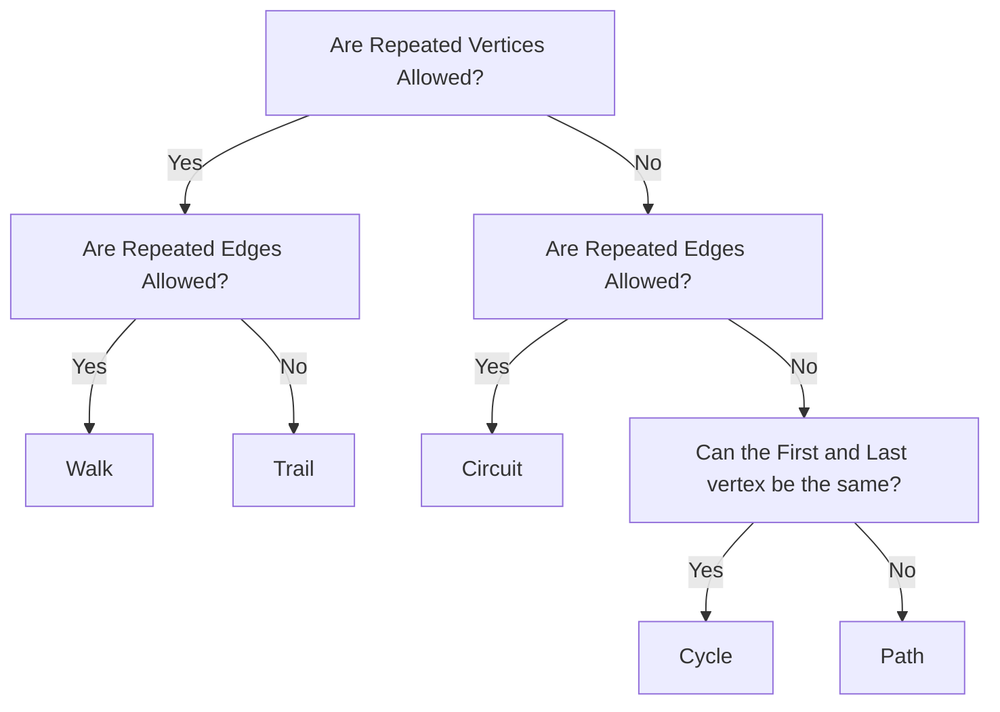



---
### What is a Network?
- A network is a visualisation of objects and how they are connected
- Networks have 3 key features:
  - The Network is the entire visualisation
  - The vertices (singular: vertex) are the objects in the network, represented as points/dots
  - The Edges are the lines connecting the vertices
### What properties can network features have?
- Vertices have a property known as its "degree", which is the number of other unique vertices it is connected to
- Edges have two properties: weight (how strong the connection is) and direction (if a connection is one-way or two-way)
  - Edges with direction have an arrow pointing in the direction they travel
  - Loops are a special type of edge:
    - A loop starts and ends at the same vertex
    - It counts as 1 edge, but adds two to the degree of the vertex
### How are Vertices represented?
- Vertices can be represented by listing them all in braces:
> $\color{orange}{V= \\{ A,B,C,D,E,F \\} }$
### How are Edges represented?
- Edges are represented by writing the start and end points in brackets
- For example, an edge between $A$ and $B$ would be represented as $(A,B)$
- A loop is represented the same as an edge, but with the vertex in both places
  - For example, a loop around $X$ would be represented as $(X,X)$
- In a Network diagram, the weight of an edge is written next to it as a label
> 
> *The vertices are A, B, C, D, E, and F, and the weights of the edges are the numbers in red.*
### How are networks navigated?
- A *walk* is a connect set of edges from one vertex to another
- An example of a walk is a GPS guided drive, in which each street is an edge, and your start and end point are the vertices
- Usually, your aim is to find the shortest possible walk between any two vertices, or to find a path which includes every edge/vertex
#### What types of walk are there?
- A trail is a walk in which no edge is traversed more than once (i.e. no repeated edges)
- A path is a walk with no repeated vertices or edges
- A circuit is a walk with no repeated edges which starts at the same vertex it ends on
- A cycle is a walk with no repeated vertices which starts at the same vertex it ends on
- This is "neatly" summarised by this flowchart:

### How are Networks Drawn?

1. Mark out every vertex ***IN PENCIL***
2. Connect any connected vertices with edges **IN PENCIL**
3. Label each vertex
4. Label the weight and direction of each edge

### What is an isomorphic network?

- An isomorphic network is a network in which every edge has the same weight, and every vertex has the same degree 

### What are Eulerian Trails?

- Eulerian trails are trails which use every edge of a network exactly once
- By definition, they must start and end at different vertices
- Eulerian trails will always exist if there are exactly two vertices with an odd degree
  - These two vertices must be the start and end of the trail

### What are Eulerian Circuits?

- Eulerian circuits are a subset of eulerian trails
- They are identical to Eulerian trails in every way, except that they start and end at the same point (because they are circuits)
- Eulerian circuits will always exist if every vertex is of even degree

### What is a Tree?

- A tree is a connected graph which has no cycles or loops
- In a tree, the number of edges is always 1 less than the number of vertices

#### What is a Spanning Tree?

- Within a network, there will always be a tree which can be created
- A tree which connects all of the vertices in a network is known as a spanning tree
- Minimum spanning trees are spanning trees which have the lowest possible total weight
  - The sum of the weights of each edge should be as low as possible, while still connecting every vertex

#### What is Prim's Algorithm?

- Prim's algorithm is a set of rules to determine a minimum spanning tree of a graph:

1. Choose any vertex (vertex 1)
2. Follow the edge with the lowest weight to the next vertex (vertex 2)
3. Follow the edge of vertex 2 with the lowest weight, excluding the edge connecting to vertex 1
4. Repeat step 3, ignoring edges which will result in doubling up on a vertex, until all vertices are connected

#### What is a Connector Problem?

- Connector problems use minimum spanning trees to find the lowest cost method to link multiple objects to a network
- They usually take the form of "Which path will be the lowest cost, while reaching every vertex in the network?"

#### How can the Shortest Path Between Vertices be Calculated?

- The shortest path is the path between two vertices with the lowest total edge weight
- Following Prim's algorithm between the two vertices is the most efficient way to do this



Found this post useful? [Support us on Patreon.](https://patreon.com/schoolnotes)

