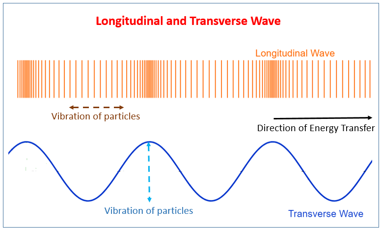

<!-- Start content below this line. If you need help, go to https://schoolnotes.xyz/docs/posts/ -->

---
## Wave Properties

- Vibrating objects transfer energy through waves
- Waves are classified by what they move through
- There are two types: mechanical and electromagnetic

### Mechanical Waves

- Mechanical waves transfer energy through vibrations in a medium
- Examples include water, sound and wind
- A wave can be a single pulse, or continuous

> Waves only transfer energy from one point to another. THEY DO NOT TRANSFER MATTER!
> However, matter may move as the wave passes through it.

- Mechanical waves can be either transverse or longitudinal.
  - In a transverse wave, particles oscillate (move back and forth) perpendicular (at 90°) to the direction of energy transfer.
  - In a longitudinal wave, particles move parallel to the direction of energy transfer.
    
    
- [This simulation demonstrates a wave - PHET COLORADO](https://phet.colorado.edu/sims/html/wave-on-a-string/latest/wave-on-a-string_en.html)

### Measuring Mechanical Waves

- Waves can be represented by displacement-distance graphs and displacement-time graphs.
- The graph takes a sinusoidal shape (like a sine wave)
  

### The Role of the Medium 

- Speed of sound waves in a medium depends on 2 main factors: 

1. Elasticity of the medium 
2. Density of the medium 

- The more rigid a material is, the faster the mechanical waves are transmitted 
- The more elastic a material is, the slower a mechanical wave is transmitted
- The higher the temperature a given medium is, the faster a mechanical wave will move through it.

## Electromagnetic Waves

- All EM waves propagate through space at $3\times10^{8}m/s$ 
- EM waves do not require a medium as they self-propagate
- A charged particle produces an electric field. 
- A moving charged particle produces a magnetic field. 
- An oscillating charged particle produces an EM wave. 
- EM waves consist of perpendicular electric and magnetic fields.

### Other Properties of EM Waves

- All EM waves are transverse waves. 

- All able to undergo: 
  - Reflection
  - Refraction
  - Polarisation
  - Interference 
  - Diffraction 
- All EM waves travel in straight lines

### Displacement-Time Graph of a Transverse Wave

The displacement time graph of a transverse wave shows how a single particle is displaced from natural resting position as a function of time

### Wavefronts and Rays

- Rays refer to direction in which energy moves from initial disturbance which created the wave
- Wavefront essentially marks points at which energy of particles are equal

# References

<!-- Footnotes and references go below this line -->