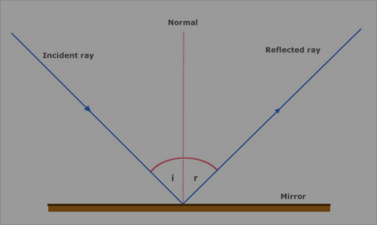

<!-- Start content below this line. If you need help, go to https://schoolnotes.xyz/docs/posts/ -->

---
## Wave Properties

- Vibrating objects transfer energy through waves
- Waves are classified by what they move through
- There are two types: mechanical and electromagnetic

### Mechanical Waves

- Mechanical waves transfer energy through vibrations in a medium
- Examples include water, sound and wind
- A wave can be a single pulse, or continuous

> Waves only transfer energy from one point to another. THEY DO NOT TRANSFER MATTER!
> However, matter may move as the wave passes through it.

- Mechanical waves can be either transverse or longitudinal.

  - In a transverse wave, particles oscillate (move back and forth) perpendicular (at 90°) to the direction of energy transfer.

  - In a longitudinal wave, particles move parallel to the direction of energy transfer.

    

- [This simulation demonstrates a wave - PHET COLORADO](https://phet.colorado.edu/sims/html/wave-on-a-string/latest/wave-on-a-string_en.html)

### Measuring Mechanical Waves

- Waves can be represented by displacement-distance graphs and displacement-time graphs.
- The graph takes a sinusoidal shape (like a sine wave)
  

### The Role of the Medium 

- Speed of sound waves in a medium depends on 2 main factors: 

1. Elasticity of the medium 
2. Density of the medium 

- The more rigid a material is, the faster the mechanical waves are transmitted 
- The more elastic a material is, the slower a mechanical wave is transmitted
- The higher the temperature a given medium is, the faster a mechanical wave will move through it.

## Electromagnetic Waves

- All EM waves propagate through space at $3\times10^{8}m/s$ 
- EM waves do not require a medium as they self-propagate
- A charged particle produces an electric field. 
- A moving charged particle produces a magnetic field. 
- An oscillating charged particle produces an EM wave. 
- EM waves consist of perpendicular electric and magnetic fields.

### Other Properties of EM Waves

- All EM waves are transverse waves. 

- All able to undergo: 
  - Reflection
  - Refraction
  - Polarisation
  - Interference 
  - Diffraction 
- All EM waves travel in straight lines

### Displacement-Time Graph of a Transverse Wave

- The displacement time graph of a transverse wave shows how a single particle is displaced from natural resting position as a function of time

> 

## Wave Behaviour

### Wavefronts and Rays

- Rays refer to direction in which energy moves from initial disturbance which created the wave
- Wavefront essentially marks points at which energy of particles are equal

### Reflection

- The law of reflection state that $θ_{i}=θ_{r}\newcommand{orange}{\color{orange}}\newcommand{pink}{\color{pink}}$
- A reflected wave has the same frequency, wavelength, and speed as the incident (original) wave
- Wavefronts are identical before and after reflection

> 

$\newcommand{orangebox}{\bbox[5px, border: 2px solid orange]}\newcommand{pinkbox}{\bbox[5px, border: 2px solid pink]}\newcommand{greenbox}{\bbox[5px, border: 2px solid green]}$

#### Convex Mirrors

> 

- Rays diverge after reflection
- Used in car mirrors and surveillance systems

#### Concave Mirrors

> 

- Curves inward and waves converge at the focus
- Used to reflect microwaves or radio waves from collecting dishes to receiving antenna

### Refraction

- When an EM wave travels from one medium to another some of the wave will be absorbed, some reflected, and the rest propagates through the new medium

> 

$$\color{orange}{n_{1}\sin\left(\alpha\right)=n_{2}\sin\left(\beta\right)}$$

- Where $\alpha$ and $\beta$ are the angles from the *normal* (the red line in the image) and n values are the refractive indices of the media
  - the refractive index of a material will usually be given in exams, but it is useful to remember that air is $n\approx 1,$ glass is $n\approx 1.5,$ and water is $n\approx \frac{4}{3}$
  - Usually, a more dense substance will have a higher refractive index

When light moves from one medium to another:

- Frequency of light remains unchanged 
- Wavelength of light changes 
- Velocity of wavelength changes
- When a wave slows down, it bends **towards the normal**



If the boundary is struck parallel to the normal, the wavelength and speed still change, but the direction does not.



### Diffraction

- Refers to the spreading if waves as the waves passes an object or travels through a gap between objects
- Wave diffracts around barrier at edges, leaving a shadow region behind it where the wave does not reach.
- The amount of diffraction is proportional to the wavelength AND the size of the slit:

$$\orange{\text{Diffraction}=\frac{\omega}{\lambda}}$$

> 

### Superposition

- Superposition is the overlapping of two waves
- There are two types of superposition: constructive (waves add to make a larger wave) and destructive (waves cancel each other out to make a smaller wave)
- Superposition results in a temporary change of frequency, amplitude and phase
- Once the waves have passed each other, the superposition collapses, and both waves return to their original properties

### Standing Waves

- Standing waves are waves which do not appear to be moving along the medium
- Instead, the *antinodes* (peaks and troughs) seem to switch displacement twice every cycle

- Standing waves are frequently used in music, where:

$$\orange{\mathcal{f}\_{n}=n\cdot\mathcal{f}\_{1}}$$

$$\orange{\lambda_{n}=\frac{1}{n}\cdot\lambda_{1}}$$

- In other words, the frequency of harmonic n is equal to n multiplied by the frequency of harmonic 1 (usually middle C)

> 

### Resonance

- A phenomenon in which a vibrating system or external force drives another system to oscillate with greater amplitude at specific frequencies
- Occurs at frequencies where response amplitude is a maximum is termed “resonant frequency”

## Sound Waves

- Sound is a mechanical wave; the wave is caused by a vibrating source. 
- Travel as alternating regions of compressions and rarefactions. 
- Travel at 343m/s
- Changes depending on air pressure and temperature

> 

- Sound waves are measured in $W/m^2$, and are calculated by:

$$\orange{I=\frac{P}{4πr^{2}}}$$

### Frequency and Pitch

- Frequency is the quantitative equivalent of pitch

### Amplitude and Volume

- Amplitude and volume are *directly proportional* (increasing one increases the other)

