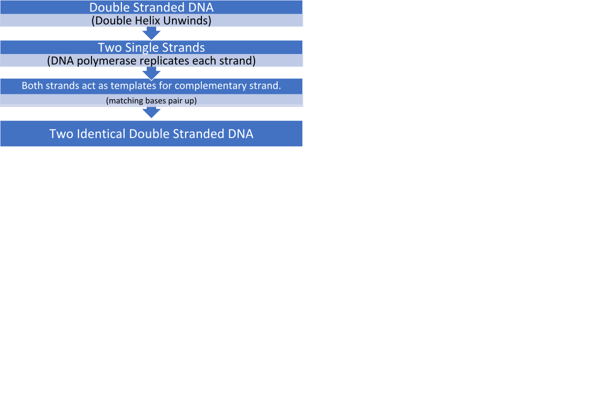
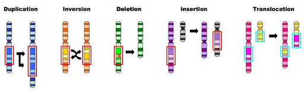
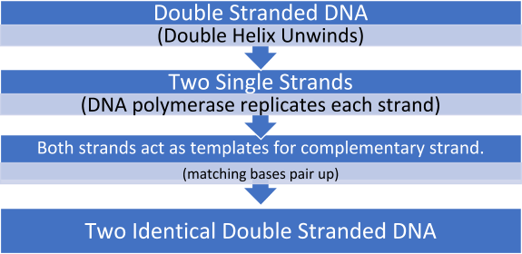

{}

## Module 5: Hereditary

**Asexual reproduction:** Requires only one parent. Parent cell replicates and divides to create genetically identical offspring.

**Sexual reproduction:** Requires two parents. Haploid gamete cell from each parent produces genetically unique offspring.

<table>
  <tr>
   <td>
   </td>
   <td>Disadvantages
   </td>
   <td>Advantages
   </td>
  </tr>
  <tr>
   <td>Sexual Reproduction
   </td>
   <td>-Energy costly.

-Requires 2 parents.

-Courtship is time and resource consuming.
   </td>
   <td>-High genetic diversity.

-Less prone to environmental change.
   </td>
  </tr>
  <tr>
   <td>Asexual Reproduction
   </td>
   <td>-Low genetic diversity.

-Prone to environmental change.
   </td>
   <td>-Energy efficient.

-Requires 1 parent.

-No courtship required.
   </td>
  </tr>
</table>

### Sexual reproduction in plants

Male:

*   Anther – produces pollen.
*   Filament – supports anther.

Female:

*   Stigma – sticky bulb that catches pollen (sex cells)
*   Style – passageway for pollen.
*   Ovary – holds the eggs awaiting fertilisation
*   Ovum – ‘small egg’ that grows into a seed after fertilisation.

### Sexual reproduction in animals

Haploid male and female gametes unite (fertilisation) producing genetically unique offspring.

### Asexual reproduction in animals

*   Budding – E.g coral. Bud comes off parent organism and eventually develops into a new branch, or it breaks off.
*   Regeneration/fragmentation – E.g starfish. Part of parent organism breaks off; it will regenerate to become new individual.
*   Parthenogenesis – E.g honeybees. Development of female gametes without fertilisation, ‘virgin birth’.

<table>
  <tr>
   <td>
   </td>
   <td>
Definition
   </td>
   <td>Disadvantages
   </td>
   <td>Advantages
   </td>
  </tr>
  <tr>
   <td>Internal Fertilisation
   </td>
   <td>Sperm and egg unite within female body.
   </td>
   <td>-Higher energy requirement to care for offspring.

-Less offspring produced.
   </td>
   <td>-Fertilisation more likely to occur.

-Offspring more likely to survive.

(protected from predators).
   </td>
  </tr>
  <tr>
   <td>External Fertilisation
   </td>
   <td>Sperm and egg unite outside female body.
   </td>
   <td>-Many gametes go unfertilised.

-Offspring often not protected.
   </td>
   <td>-Little energy required to mate.

-Large numbers of offspring produced.
   </td>
  </tr>
</table>

*   **Fungi** reproduce both sexually and asexually.

Commonly asexually, fungi reproduced through spores. Fungi sexually reproduce in adverse conditions, so genetic variation is ensured.

### Hormone control of pregnancy

Hormone – a chemical substance produced in the body, regulates activity of certain cells/organs.

There are two phases in the menstruation cycle;

*   Follicular phase, 1 – 14 days.
*   Luteal phase, 14-28 days.

Five hormones are involved in controlling pregnancy:

*   FSH – stimulates development of the egg.
*   LH – development of the ovum, involved in inducting ovulation. Stimulates estrogen and progesterone.
*   Progesterone – stimulates regrowth of uterine lining, inhibits release of FSH and LH.
*   Estrogen - improves the formation of blood vessels, transfers nutrients, and steadily increases during pregnancy. Reaches its peak in the third trimester. Rapid increase causes nausea with pregnancy.
*   Prolactin – hormone produced in pituitary glands, produces breastmilk and increases breast size. Prolactin levels increase 10 to 20 times, these levels stay high if the woman decides to breastfeed, if not the levels decrease.
*   Oxytocin aids delivery by helping the uterus contract.
*   Embryo – 2nd to 8th week after fertilisation.

- Fetus – more than 8 weeks after conception.

#### Binary fission

A method of asexual reproduction that causes a separation from the parent cell to create a new organism. The genetic material of the parent will duplicate, and then divide into two parts.

Produces genetically identical offspring (asexual reproduction).

#### Meiosis

_IIPMATC-PMATC_

*   Interphase I1: -Centrosomes duplicate.

- Chromosomes not visible.

*   Interphase I2: -Chromosomes duplicate, homologous pairs
*   Chromosomes visible.
*   Prophase I: -Meiotic spindle begins to form.
*   -Nuclear envelope fragments.
*   Crossing over occurs (genetic recombination).

*   Metaphase I: Chromosomes line up in the middle of cell.
*   Centrosomes move to opposite poles of cell.

- Meiotic spindle attaches to centromere.
- Independent assortment occurs.

*   Anaphase I: - Chromosomes pull away to opposite poles of cell.
*   Telophase I: - Two nuclei are formed on opposite poles of cell, encasing chromosomes.
*   Cytokinesis I: -Cell divides.
*   Prophase II: -Meiotic spindle forms.
*   Nuclear envelope fragments.
*   Centrosomes duplicate.

*   Metaphase II: Homologous pairs line up in middle of cell.
*   Centrosomes move to opposite poles of cell.
*   Meiotic spindle attaches to centromeres.

*   Anaphase II: - Chromatids are pulled to opposite poles of the cell.
*   Telophase II: - Two nuclei are formed on opposite poles of cell, encasing chromatids.
*   Cytokinesis II: - Four genetically unique haploid (n) sex cells formed.

#### Mitosis - IPMATC

Interphase – centrosomes duplicate, chromosomes duplicate (not visible)

Prophase – nuclear envelope fragments, meiotic spindle begins to form, chromosomes visible.

Metaphase – chromosomes line up in middle of cell, meiotic spindle attach.

Anaphase – chromatids pulled apart to opposite poles of cell.

Telophase – two nuclei are formed opposite poles of cell.

Cytokinesis – cell divides creating two genetically identical cells.

**DNA Replication Flow Chart**

DNA Polymerase is an enzyme that causes nucleotides to form a complimentary DNA strand.

<table>
  <tr>
   <td>DNA in Eukaryotes
   </td>
   <td>DNA in Prokaryotes
   </td>
  </tr>
  <tr>
   <td>-The DNA of eukaryotes is found in the nucleus of the cell.

-The DNA is found inside chromosomes.

-Chromosomes are linear in shape.

-The DNA is coiled around proteins called histones.
   </td>
   <td>-The DNA in prokaryotes aren’t bound with proteins.

-Circular in shape.

-Found freely in cytoplasm.

-Contains extra-chromosomal plasmids which can replicate independently. (double-stranded DNA molecules)
   </td>
  </tr>
</table>

**Histones:** DNA packaging proteins.

### Polypeptide Synthesis

**1 -** Transcription.

-RNA polymerase binds to a part of the DNA and causes the DNA to unzip.

-Information is copied into a new molecule of messenger (mRNA).

-Thymine is replaced with uracil, nitrogen bases A, G, C remain unchanged.

-mRNA will move into the cytoplasm and translation will occur.

**2– Translation**.

-The mRNA will translate into a series of amino acids based upon its codon, which is a pair of three nucleotides.

-A tRNA molecule with an anti-codon sequence will match up with its corresponding codon to deliver the right amino acid.

-The amino acids delivered by the tRNA will become linked by peptide bonds, creating peptides.

-Proteins are made up of polypeptide chains, and polypeptides are made of peptides made by these amino acids.

**tRNA:** A small RNA molecule that carries an amino acid and anti-codon sequence.

**Codominance:** Two alleles are present, but neither one is dominant so both are expressed.

*   Roan cow, both red and white are expressed, blotches of red and white.

**Incomplete dominance:** Neither allele is dominant. Neither allele is 100% expressed. You get a blending of traits.

*   White and red flower creates completely new phenotype (pink).

#### Multiple Alleles

Blood type is an example of multiple alleles because there are three alleles. A, B and O.

*   Red blood cells have different surface antigens – A, B, AB or O. E.g. type A blood cells have A antigens on their surface. **O does** **not have** any A or B antigens on its surface, consider it ‘naked’. O can give to anyone, but can only receive from blood type O.
*   The O gene is recessive. Can only be ii.

**Autosomal:** Trait is not on a sex chromosome (X or Y).

*   Can be autosomal recessive, or autosomal dominant.

## Module 6: Genetic Change

Nucleotides are composed of three molecules-

Phosphate – Deoxyribose sugar – Nitrogen base (A, T, G, C)

**Enzymes** speed up chemical reactions by lowering the required energy.

*   Example catalase, found in liver.

**Genotype** is the combination of alleles for a trait.

**Phenotype** is the physical expression of a trait.

**Mutation**: a permanent change in the nucleotide sequence in DNA.

They can be harmful, beneficial or neutral.

*   SNP – Single Point Mutation – substitution of a single nucleotide.
*   Silent mutation – substitution of a single nucleotide and still codes for the same amino acid.
*   Nonsense mutation – substitution of a single nucleotide which results in a stop codon. _Commonly causes non-functional protein._
*   Missense mutation – substitution of a single nucleotide which results in a different amino acid. _Commonly causes non-functional protein. (e.g. sickle cell anaemia)_
*   Deletion – when one or more nucleotides delete resulting in a frameshift mutation.
*   Insertion – the addition of a nucleotide which results in a frameshift mutation, unless an entire codon is added which is unlikely.

### Chromosomal Mutations

1.  Deletion – One region of a chromosome is removed, **reduces number of genes.**
2.  Insertion – Part of the DNA is duplicated and inserted into a homologous chromosome. **Location is important, if it is an exon, it is more likely to have a phenotypic effect than an intron would.**
3.  Inversion – One region of a chromosome is flipped 180 degrees and reinserted. **This gene will read back to front, big problems e.g. Haemophilia.**
4.  Translocation – A region from one chromosome is removed and added to another which is not its homologous. **Can lead to gene fusion.**
5.  Aneuploidy – Changes in chromosome number. One or more extra copies of an entire chromosome, or an entire chromosome is missing. **E.g. Down Syndrome, Trisomy 21.**

Chromosomal mutations occur in meiosis. They occur in either crossing over, or in independent assortment.

**DNA Sequencing:** Determines the precise order of nucleotides within a segment of DNA. It is not a specific technology; it is any technology that can do this.

**DNA profiling:** Analysis of STR’s, Short Tandem Repeats. Found in DNA.

The more similar an individual’s STR’s are to another person, the more related they are.

**Gel Electrophoresis:** Used in DNA profiling. Separates large molecules at different sizes e.g. proteins + DNA.

**Polymerase Chain Reaction (PCR)** Amplifies genes or DNA. With a small sample, the DNA polymerase (an enzyme) can make new copies of the DNA.

_This occurs from first denaturing, second annealing, third elongating._

### How does UV light cause mutation?

Too much UV light can kill skin cells by damaging their DNA. If enough DNA damaged builds up, it can cause cells to start growing out of control. This can result in the non-infectious environmental disease melanoma.

### How do cigarettes cause mutation?

There are thousands of chemicals in a cigarette, and 60 of them are carcinogens. Carcinogens contribute to the formation of cancer.

These carcinogenic chemicals are absorbed into the blood and results in the cells mutating. This is what results in the formation of cancer.

**Artificial Insemination:** The process where sperm from a male with desirable traits is artificially inseminated to a female.

<table>
  <tr>
   <td>Advantages
   </td>
   <td>Disadvantages
   </td>
  </tr>
  <tr>
   <td>
<ul><li>Transport of semen is easier than transporting a whole animal.
<li>Semen can be stored for long periods.
</li>
</ul>
   </td>
   <td>

<ul><li>Cannot guarantee favourable traits will be passed on.
<li>Reduced genetic variation results in population susceptible to environmental change.
</li>
</ul>
   </td>
  </tr>
</table>

**Selective breeding:** The intentional mating of individuals with desirable traits, in the hope the desired traits will be in the phenotype of the offspring.

(Past Biotechnology)

**Artificial Pollination:** The process where pollen from a plant with desirable traits is artificially transferred to the female stigma of another plant.

Stigmas are removed from female plant to avoid self-pollination.

**Organism Cloning:**

The process by which genetically identical copies of an organism have been made without any type of reproduction.

<table>
  <tr>
   <td>Advantages
   </td>
   <td>Disadvantages
   </td>
  </tr>
  <tr>
   <td>-Guaranteed to express desired trait.

-Cloned plants have identical requirements.
   </td>
   <td>-Offspring are susceptible to environment change.
   </td>
  </tr>
</table>

**Transgenesis:** The process by which a gene is removed from one species and inserted into the genome of another species.

*   The organism’s genome will be amplified using PCR, and the desired gene will be separated from the DNA of that organism by using a restriction enzyme. The gene would then be inserted into a bacterial plasmid, upon which the plasmid would then be reinserted into a bacterium. Every time that bacteria undergoes cell division, it would create a copy of that gene (gene cloning).

**This process can be used for the production of human insulin.**

**Transgenic organism:** An organism that contains genes from a different species inserted into its genome. For example, **Bt. Cotton.**

*   Regular cotton was attacked by a pest (the bollworm) that eats the bud. In response, farmers used insecticides that resulted in killing all insects, including bees and ants. Bt. Cotton is a transgenic organism that has a certain gene inserted into its genome from the bacteria (Bt). This gene can produce a toxin that kills the bollworm, hence protecting the crop.

**Gene:** A section of DNA which contains instructions for proteins.

**Future Biotechnology:** CRISPR.

CRISPR _(Clustered Regularly Interspaced Short Palindromic Repeats) _is a genome editing technique. **It is a defense system for bacteria.** If the DNA of an invading virus entered the cell, the enzyme (CRISPR) would chop off the DNA. Genes can now be spliced and inserted with immense accuracy.

<table>
  <tr>
   <td>Introns
   </td>
   <td>Exons
   </td>
  </tr>
  <tr>
   <td>
<ul>

<li>Sections of mRNA that do not code for proteins.

<li>Removed from the strand of pre-mRNA.

<li>Broken down and recycled.
</li>
</ul>
   </td>
   <td>
<ul>

<li>Sections of mRNA which become “expressed” or translated into a protein.

<li>Once introns are removed the exons are spliced with other exons to create a chain of mature mRNA.

<li>Mature mRNA moves into ribosome where instructions are translated into a protein.
</li>
</ul>
   </td>
  </tr>
</table>

<table>
  <tr>
   <td>Somatic Mutations
   </td>
   <td>Germ-line Mutations
   </td>
  </tr>
  <tr>
   <td>
<ul>

<li>Genetic mutation in somatic cells.
</li>
</ul>
   </td>
   <td>
<ul>

<li>Genetic mutation that occurs in the sex cells.

<li>For example, a non-disjunction. The failure of chromosomes to separate in meiosis anaphase that result in aneuploidy (missing or extra chromosome). E.g. Down Syndrome, Trisomy 21.
</li>
</ul>
   </td>
  </tr>
</table>

### Population Genetics

*   **Genetic drift** – changes in allele frequency due to random change. E.g. A person accidentally steps on most of the green beetle population.
*   **Gene flow** – transfer of genetic information from one population to another.
*   **Bottleneck effect** – significant reduction of a population, results in reduced genetic variation. E.g. Cheetah, resulted in inbreeding. Reduced genetic variation.

## Module 7: Infectious Disease

**Louis Pasteur** – proved the ‘germ theory’.

He boiled broth in 1 straight necked flask and 1 swan necked flask, to remove any microbes in the broth at first.

*   The straight necked flask was exposed to the air, which resulted in microbial growth. The swan necked flask was not exposed directly to the air and resulted in no microbial growth. This proved the germ theory.

### Koch’s Postulates

*   The microorganism must be found in all organisms with the disease.
*   You must be able to isolate the microbe from the diseased organism and grow it in culture.
*   The cultured microbe must cause the same disease once introduced to a healthy animal.
*   Once again, the microbe from the introduced now diseased animal will be isolated to determine it is the same organism.
*   Robert Koch discovered the bacterium that cause the diseases cholera and Tuberculosis.

### The Innate Immune System

The innate immune response is the first and second line of defence.

First line of defence is physical and chemical barriers preventing any pathogens from entering the body. For example:

*   Mucus membranes. Mucus membranes are a chemical barrier and can be located in the nose and eyes. Mucus is sticky and traps microbes; it also contains enzymes that kill pathogens.
*   Small hairs in the nose. These hairs are a physical barrier and filter the microbes and dust attempting to enter the body, and are then expelled by sneezing.

The second line of defence causes an inflammatory response that releases histamines which causes the increase of white blood cells. Phagocytes, a type of white blood cell will engulf microbes and try to remove any foreign invaders.

Temperature in the body will also rise to a level that pathogens cannot cope in.

*   Increase in temperature will also increase enzyme activity.

### The Adaptive Immune System

The adaptive immune system is the third line of defence and will remember previously encountered pathogens.

*   The Adaptive Immune System **is consistent with lymphocytes** which are white blood cells named **B-cells**, and **T-cells.**

B cells can either **differentiate** into **memory B-cells**, or **plasma cells**.

*   Memory B-cells retain a specific antibody on its surface
*   Plasma B-cells create antibodies to flag a specific antigen, upon which killer T-cells will destroy it.

#### Primary Exposure

1. The third line of defence **is activated once** the immune system **detects a foreign antigen** (a substance on the surface of a pathogen) by a phagocyte engulfing it.
2. Foreign antigen is **incorporated into major histocompatibility complex**  on phagocyte.
3. Phagocyte will **bind** to Helper T-cell.
4. Helper T-cell will **release cytokines** which will result in three things.

-  Production of **Killer T cells.**
-  Production of **Memory T cells** and **B cells.**
-  **Differentiation** of **B-cells to plasma cells** (will produce antibodies).

#### Secondary Exposure

Antibody production will be much faster, resulting in faster elimination of the pathogen.

A secondary exposure means the pathogen will quickly encounter a memory B-cell.

1. The memory B cell will bind to the foreign antigen.
2. The memory B cell will then differentiate into a plasma cell.
3. The plasma cell will release antibodies.
4. T-cells will release cytokines and killer T cells will eliminate that specific foreign antigen.

**Australian Plant with Fungal Disease:** Sooty mould is a fungal disease that infects bottlebrushes and causes a black, powdery fungus that reduces the plant’s ability to photosynthesise.

As a response to pathogens plants have physical, chemical and specific response.

**Physical barriers include:**

*   Bark
*   Waxy cuticles.

**Chemical barriers include:**

*   Glucosides, antibacterial.

If their physical barriers become breached, they have a recognition system that recognises the chemical and physical signals from pathogens. As a result, the plant will change the permeability of the cell wall and trigger cell apoptosis to minimise tissue damage. It is essential for clearance of certain pathogens.

<table>
  <tr>
   <td>Disease caused:
   </td>
   <td>Pathogen:
   </td>
   <td>Transmission:
   </td>
  </tr>
  <tr>
   <td>Malaria
   </td>
   <td>Plasmodium – Protozoan
   </td>
   <td>Mosquito is used as a vector.
   </td>
  </tr>
  <tr>
   <td>Ringworm
   </td>
   <td>Fungal infection.
   </td>
   <td>Skin-to-skin contact.
   </td>
  </tr>
  <tr>
   <td>Tuberculosis
   </td>
   <td>Bacteria – Mycobacterium tuberculosis.
   </td>
   <td>Small droplets produced by an infected person coughing.
   </td>
  </tr>
  <tr>
   <td>COVID-19
   </td>
   <td>Virus
   </td>
   <td>Small droplets produced by an infected person coughing.
   </td>
  </tr>
  <tr>
   <td>CJD – Jacob’s Disease
   </td>
   <td>Prion
   </td>
   <td>Can only be transmitted through consuming infected brain matter/nervous tissue.
   </td>
  </tr>
  <tr>
   <td>Plague
   </td>
   <td>Bacteria
   </td>
   <td>The bacteria are often transmitted by the bite of an infected flea.
   </td>
  </tr>
</table>

<table>
  <tr>
   <td><strong>Prion</strong>
   </td>
   <td><strong>Bacteria</strong>
   </td>
   <td><strong>Virus</strong>
   </td>
   <td><strong>Fungi</strong>
   </td>
   <td><strong>Animal</strong>
   </td>
   <td><strong>Plant</strong>
   </td>
  </tr>
  <tr>
   <td>-Doesn’t contain nucleic acids.
   </td>
   <td>-Unicellular

-Cell wall

-Prokaryotic
   </td>
   <td>-Are not living, requires a host.
   </td>
   <td>-No chlorophyll

-Chitin Cell Wall
   </td>
   <td>-Eukaryotic

-Lack cell wall
   </td>
   <td>-Eukaryotic

-Cellulose cell wall
   </td>
  </tr>
</table>
**Non-Infectious Nutritional Disease:** Scurvy.

*   Caused by lack of Vitamin C in the diet. Vitamin C is essential to making collagen, without it bleeding gums as new blood vessels are unable to be made.

**Malaria:**

_How it facilitates entry:_

Malaria facilitates its entry using a vector, that being a mosquito.

*   Once an infected mosquito feeds on an individual, the protozoan (plasmodium) in the saliva of the mosquito will enter the blood stream.

_How it transmits between hosts:_

*   The protozoan that causes the disease lives in the red blood cells of humans, so if a mosquito feeds on an individual infected with malaria, the protozoan is transmitted to the mosquito.
*   The pathogen will then live in the mosquito’s saliva, and once that mosquito feeds on another individual (uninfected) they will transmit the pathogen.

### How does hygiene prevent disease?

In 1846 it was proven there was a link between women dying in childbirth and lack of washing hands. As a result, the following was introduced:

*   Washing hands regularly.
*   Gloves.
*   Sterile instruments.

After these procedures were introduced, **women dying in childbirth dropped.** This is because pathogens could not travel into the surgery room due to the sterile environment.

### How does quarantine prevent disease?

Quarantine is the method of isolating a diseased organism from the rest of the population. Quarantine can last for any period of time, until that organism is not diseased or infectious. This prevents the disease from spreading.

*   For example, in the COVID19 epidemic, people travelling into Australia had to quarantine for 14 days, the incubation period for the disease.
*   Also, you cannot bring certain foods into Australia as they may possess disease causing microbes. Same for soil, organic items.

### How does vaccination prevent disease?

Passive Immunisation:

Natural:

Antibodies acquired from the mother via breastfeeding/placental transfer. Lasts usually 6 months upon birth.

Artificial:

The introduction of antibiotics to an organism which provides short-term immunity to bacteria.

*   Antibiotics will inhibit the formation of the bacterial cell wall, as a result the bacteria cannot divide. First antibiotic was penicillin.

Active Immunisation:

Natural:

When the body becomes naturally infected with a pathogen and the immune system creates a response against it. B-cells will produce specific antibodies for that pathogen, and memory cells will make it so upon second exposure to the pathogen, the immune systems response is faster.

Artificial:

Vaccination is when some pieces of DNA of a pathogen will be injected into your body to trigger an immune response. As a result, your body will produce memory T and B cells so upon exposure to that pathogen, the immune system can create a rapid response. The memory cells will ensure that many antibodies will be produced to remove the pathogen from your body.

*   There are also live vaccines, where a weakened pathogen is injected into the body to produce an immune response. This response will generally be much greater than a non-live vaccine.

### How do pesticides prevent disease?

There are many types of pesticides, each effective against a specific type of pest. Such as, insecticides (insects).

*   Pesticides can kill these pests that carry certain diseases. In a malaria prone area insecticide will help control the disease spread, as mosquitos are used as a vector for the disease.

### Historical ways of controlling spread of disease

When the plague was dominant in Europe before the 1700’s, they believed disease was caused by invisible vapours ‘miasmas’. As a way of controlling the spread of disease, a large suit was worn from head to toe with herbs inside of it. These herbs would ‘neutralise the miasmas’. Was not effective because the plague was a bacteria, transmitted by flea bites.

### Current ways of controlling spread of disease

Quarantine – Isolation of diseased individuals until either disease is treated or has become non-infectious. Australia, for COVID-19 epidemic, poses a mandatory 14-day quarantine for new arrivals, 14 days is the incubation period for the disease.

*   Technological Applications – COVIDSafe. COVIDSafe is an app that can determine if you have been in contact/near a recently registered person with COVID. This way you can begin isolating immediately without spreading disease.

Antiviral: **Rapivab**

This antiviral is used for the treatment of serious cases of Influenza.

The drug is effective, but costly. One dose is equivalent to around 1000 dollars.

**Incidence:** What is the risk of getting this disease?

Incidence = new cases of disease during time period

**Prevalence:** Proportion of people that have the disease at a time period.

Prevalence = Cases in a period of time

**Protection of Indigenous Culture:**

Western Australia’s government gave away Aboriginal rights for smoke bush. No royalties given to the aboriginal people.

## Module 8: Non-Infectious Disease and Disorders

**Homeostasis:** The maintaining of a stable internal state despite changes in the world outside. Maintained by both nervous system and endocrine system.

**Stimulus response**: When a change (e.g. touching something hot) is detected by a receptor e.g. cell or organ which then the receptor communicates with an **effector** which produces a response.

*   The message that is sent by a receptor (for something hot) travels to the effector which initiates a response.

**Endotherm:** Capable of producing their own body heat.

**Ectotherm:** Relies on the regulation of body heat by external sources.

**Temperature Negative Feedback Loop:**

Temperature is measured by the hypothalamus, and is kept at 36.7 degrees.

Temperature is regulated by physiological and behavioural negative feedback loops.

Example: Physiological

As a response to a **decrease in body temperature**, the body shivers creating warmth by expending energy.

*   As a response to an **increase in body temperature**, the body sweats which expends heat as it evaporates.

Example: Behavioural 

-If the hypothalamus detects high body temperature, as a behavioural reaction that person would feel the need to enter the shade.

-If the hypothalamus detects low body temperature, as a behavioural reaction that person would feel the need to move into the sun.

**Glucose Negative Feedback Loop:**

*   The pancreas produces insulin and glucagon.
*   The liver responds to insulin and glucagon.

-**Insulin** stimulates the liver to absorb glucose from the blood, lowering blood glucose concentration. It is then stored as **glycogen.**

(Insulin is a hormone, produced and regulated by beta cells in the pancreas)

-**Glucagon** stimulates the liver to convert stored glycogen into glucose and release it into the blood, raising blood glucose concentration.

(Glucagon is a hormone that counteracts the actions of insulin and is secreted by alpha cells).

### Homeothermy

Maintenance of a stable internal body temperature.

**Structural** adaptations for Homeothermy:

*   A large or small surface area to volume ratio. Larger animals are found in the cold because they have a smaller surface area to volume ratio, which means not a lot of heat is lost. Smaller animals are abundant to hotter areas because they have a larger surface area to volume ratio, which means lots of heat is lost through the skin.
*   Insulation means that heat cannot easily be lost. Whales have a fat layer of blubber that does this.

**Physiological** adaptations for Homeothermy:

*   Counter-current flow. For example, in a killer whale’s tongue, veins and arteries run alongside each other so any heat loss due to the cold water is not actually lost, it is absorbed by the other blood vessel.

**The Nervous System:**

Delivers specific messages to a target cell rapidly. This message is carried by neurons/nerve cells.

Each nerve is a bundle of nerve cells, also called neurons.

Nervous messages are called ‘nerve impulses’, and move as a wave of electrical depolarisation.

*   Opening of membrane channels allows the movement of sodium ions through the cell membrane. This temporarily changes the electrical charge inside the neuron from negative to positive, allowing information to be transferred along the neuron.

### The Hormonal System (Endocrine System)

Delivers messages slowly and generally. This message is carried by hormones.

**Hormones** are produced in endocrine glands. Secreted directly into blood stream.

Hormones are specific and causes a response in specific organs/groups of cells.

*   They reach all cells in the body, but because e.g. the brain does not have a receptor for a glucagon hormone, it does not have an effect on the cell. On the other hand, liver cells do have a protein receptor for glucagon, which results in a change in interactions inside the cell.

#### Reflex Arcs

*   Some nervous messages do not need the brains response for appropriate action, such as when touching something hot we pull our hand away. This means a response will be much faster meaning less damage will be caused.
*   In a reflex arc the message will travel to the spinal cord along a sensory neurone, and then pass through an interneuron which will relay the message to a motor neuron, which will stimulate the response.

#### Maintaining Water Balance in Plants

Stomata are pores on the leaf which allow the exchange of carbon dioxide and oxygen. To maintain water-balance a plant can have:

1. **Curled leaves**. This results in the stomata being surrounded by humid air, instead of dry. Concentration gradient of water vapour is reduced, reducing the rate of evaporation.
2. **Sunken stomates**. The stomata are located deep in the epidermis, which increases humidity and prevents further transpiration.

**How the stomata work:**

The stomates open in times of high-water levels, when the internal water levels are low, the stomates close.

*   The guard cells surrounding the stomates aid in the exchange of carbon dioxide and oxygen as flaccid guard cells help close the stomate, turgid guard cells help open the stomates.

### Genetics

*   **Genetic Disease** – any condition caused by an abnormality in the genome, which impairs the normal functioning of the body or one of its parts.
*   **Chromosomal Abnormalities** – these include disorders caused by chromosomal number mutations, named aneuploidy (extra or missing chromosomes). E.g. Trisomy-21, or Down Syndrome
*   **Structural chromosomal mutations** – e.g. translocations, deletions, duplications of part of a chromosome.
*   **Environmental disease** – caused by factors in the environment other than pathogens. For example, chemical exposure (smoking) or radiation (UV rays).

**How does hearing loss occur?** Hearing loss is a problem with the mechanical conduction of vibrations. It can occur from:

*   Infection.
*   Excessive noise exposure.
*   Malformation at birth. Ear drum not formed properly.

Damage of auditory nerve is usually permanent.

Hearing loss can be fixed by:

*   Cochlear implants – A sound processor is placed on the skull which capture sound and sends electrical signals to the inner ear. In the inner ear is an implant which will pick up the signals sent from the sound processor and will stimulate the nerve fibres. The nerve signals then travel to the brain and register as normal hearing.
*   Bone conduction implants – A microphone is placed on the skull and transforms sound into vibrations that pass through the bone into the cochlea. The vibrations are then processed by the cochlea into normal hearing.
*   Hearing aids – Amplifies sound to make it louder, more likely for the sound wave to reach the inner ear.

**Melanoma - Non-Infectious Disease – Environmental Exposure**

<table>
  <tr>
   <td>Prevention
   </td>
   <td>Treatment
   </td>
   <td>Future Directions
   </td>
  </tr>
  <tr>
   <td>-Wearing sunscreen.

-Non-excessive amount of UV light (sunlight).

-Covering up, wearing a hat, long sleeve-shirt.
   </td>
   <td>-Surgery, not entirely efficient for metastasised cancers as cancer will still be present throughout the body.

-Chemotherapy, drugs are taken that attack cancer cells.

-Radiation therapy, use of high-powered energy beams to kill cancers.
   </td>
   <td>-Nanotechnology is a possible future direction for the treatment of cancers. Nanotechnology if available would activate multiple parts of the immune system to fight cancer, and more specifically melanoma.
   </td>
  </tr>
</table>

## Epidemiological Study: ‘Doll and Hill’

Epidemiological studies discuss the association between a suspected risk factor and disease. These studies measure health status among a population, and help us identify the major causes for a certain risk.

For example, the ‘Doll and Hill’ study identified that cigarettes have a direct correlation to lung cancer. Numerous people were interviewed in this case-controlled study, one group being those with lung cancer, another being without lung cancer.

*   The one consistent difference between the two groups was that the cancer patients were more frequent, heavier smokers compared to the non-cancer control group.

**Visual Disorders**

**Myopia** is the inability to see things unless there are close to your eyes.

When light enters a normal eye, it is bent by the cornea and the lens, which results in the light hitting the centre of the retina in the back of the eye.

In a near-sighted eye (myopia), the eye grows too long which causes the focal point to stop in front of the retina. This results in distance objects becoming blurry.

*   Myopia can be caused from family genetics.
*   Focusing of the eyes up close for extended periods is also a cause of myopia.

Myopia can be assisted by using a **concave contact lens**. Due to the cornea being curved too much, a concave lens is placed in front of the eye that adjusts the focal point back to the centre of the retina.

Myopia can also be assisted using laser surgery (LASIK).

LASIK uses lasers to reshape the cornea on your eye for the optimal curvature.

One laser will open a thin flap on the surface of the cornea, and another to reshape the cornea underneath.

**Loss of Kidney Function** occurs gradually, it does not occur ‘instantaneously’.

It can occur from high blood pressure, physical injury, diabetes, or other disorders.

The kidneys **remove wastes** such as urea from your blood using tiny filters called **nephrons**, consisting of **small blood capillaries**. Urea removed from the blood is then passed through the renal tubules to the bladder.

They kidneys ultimately act as a very efficient filtration system.

There are two treatments for **kidney failure.**

*   **Kidney transplant.** A kidney will be donated by a living or deceased individual and will be replaced with your non-functional kidney.
*   A **disadvantage** to a kidney transplant is **infection**, which could be life-threatening.
*   **Kidney dialysis.** A dialysis machine will remove waste and extra fluids from the blood and help to maintain blood pressure. The most common type of dialysis is **haemodialysis**, which will act as an artificial kidney.
*   Blood will be pumped through the machine, **fresh dialysate** will be pumped into the blood and **used dialysate** will be taken out (containing waste products e.g. urea).
*   A **disadvantage** to dialysis is that it is **not time efficient**. Patients will have to use the dialysis machine for a few hours a few times a week, which will cause some disruption to people’s schedules.
