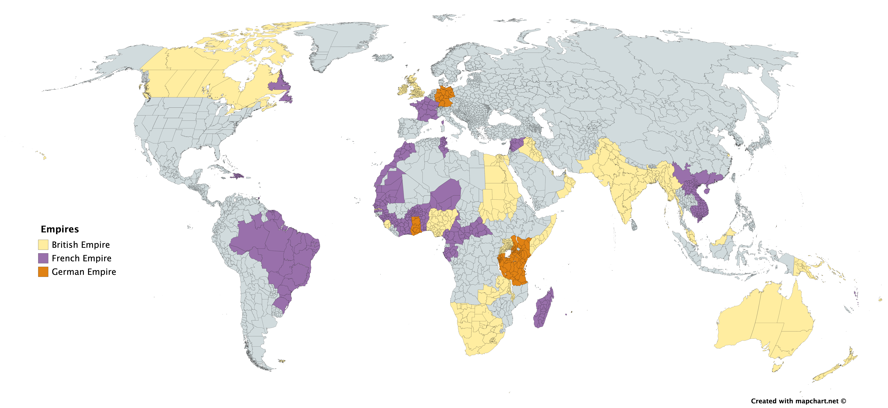

{}

<!-- Start Content below this line -->
## Causes of the First World War
### Short Term - Assassination of archduke Franz Ferdinand
[Talk: A Day in Sarajevo](/talk/a-day-in-sarajevo/)

### Long Term - Militarism
- Militarism is the principle that a country's military is crucial to maintaining the stability and prosperity of a nation [^1]
- In militaristic nations, leaders of the military often hold significant political positions, resulting in an increase in military spending
- In the 19th and early 20th centuries, military power was considered a measure of national and imperial strength
- The majority of significant military powers were based in Continental Europe (with the exception of the United States, Japan, and the Russian Empire), but most battles were fought overseas, usually in Africa, South East Aisa, or the Pacific
#### Prussian (German) Militarism
- The Prussian military was one of the most strategic militaries in Europe during the early 20th century
- The Prussian army had the best communication, weaponry, training and strategies in Europe.
- This is evidenced by their victory in the Franco-Prussian War (1871), which established the newly founded German Republic as the most effective military power in Europe
- The German *Kaiser* was the supreme commander of the German army, while the *Reichstag* (the elected parliament) had no decision-making power in military affairs
#### British Militarism
- While the Germans had the most powerful land army in the world, the British Royal Navy dominated the seas.
- British military forces imposed colonial policies in India, Africa, Asia, and the Pacific
- During the 19th century, military involvement began to be seen as a noble vocation, *"a selfless act of service to one's own country"* [^1]
- In a similar manner to Germany, soldiers (and war) were glorified romanticised in the press and in popular culture
  > One of the most famous examples of the glorification of militarism is [The Charge of the Light Brigade by Lord Alfred Tennyson.](https://www.poetryfoundation.org/poems/45319/the-charge-of-the-light-brigade)
#### Militarism's Impact on the European Powers - Economics
- The glorification of militarism meant that national spending on military skyrocketed between 1900 and 1914
  - In 1870, the combined spending of Britain, France, Germany, Austria-Hungary, Russia and Italy was the equivalent of 170 million AUD (2020).
  - By 1914, it had quadrupled to 716 million AUD (2020).
  - This expenditure was primarily driven by Germany, which had a defense budget increase of 73%, while France increased by 10% and Britain 13%
  - Russia's defeat in the Russo-Japanise war in 1905 prompted a massive budget increase in defence spending, with nearly 45% of the national budget reallocated to armed forces, compared to less than 5% on education.

>| NATION        | 1908    | 1909    | 1910    | 1911    | 1912    | 1913    |
|---------------|---------|---------|---------|---------|---------|---------|
| Great Britain | $286.7m | $306.2m | $330.4m | $345.1m | $349.9m | $374.2m |
| Germany       | $286.7m | $306.8m | $301.5m | $303.9m | $331.5m | $463.6m |
| France        | $216m   | $236.4m | $248m   | $277.9m | $307.8m | $363.8m |
| Russia        | $291.6m | $315.5m | $324m   | $334.5m | $387m   | $435m   |
| Italy         | $87.5m  | $115.8m | $124.9m | $133.7m | $158.4m | $142.2m |
| United States | $189.5m | $199m   | $197m   | $197m   | $227m   | $244.6m |
| Japan         | $93.7m  | $95.7m  | $100.2m | $110.7m | $107.7m | $104.6m |
>
> Source: Jacobson’s World Armament Expenditure, 1935
#### Militarism's Impact on the European Powers - Expansion
- With the exception of Britain, the 6 major European powers either introduced or increased conscription between 1900 and 1914
- Germany, for example, added around 170k full time soldiers to its army between 1913 and 14, with similar increases in their Navy
- In a similar timespan, Britain commissioned 29 new ships for the Royal Navy
- The early  20th century also saw significant changes to the quality of military weapons and equipment.
- Mass production became more common, and more powerful weapons such as the Gatling gun brought exponentially higher risks to the battlefield.
> *“A great European war under modern conditions would be a catastrophe for which previous wars afforded no precedent. In old days, nations could collect only portions of their men and resources at a time and dribble them out by degrees. Under modern conditions, whole nations could be mobilised at once and their whole lifeblood and resources poured out in a torrent. Instead of a few hundreds of thousands of men meeting each other in war, millions would now meet – and modern weapons would multiply manifold the power of destruction. The financial strain and the expenditure of wealth would be incredible.”*
>
> Sir Edward Gray (July 1914), British Foreign Secretary 1904-1912 [^2]

###  Long Term - Imperialism
> "You'll be back, soon you'll see, you'll remember you belong to me" - Hamilton, 2015
>
> Yeah, get ready for lots of Hamilton references in this bit :smile:.
- Imperialism is a system in which one powerful nation occupies, controls, and exploits smaller nations
- The combination of controlling country and its colonies are known as an **Empire**
  - Colonies are usually either governed by a puppet government or local representatives (such as a Governor-General in British Crown Colonies)
  - There is usually a moderate military presence stationed in the colony to suppress dissent and uprisings [^3]
  > "You say the price of my love's not a price that you're willing to pay."
  >
  > "32000 troops in New York Harbor."
- Imperialism usually has military and geopolitical advantages for the controlling country, but the main benefit is economic:
  > Is this modern history or economics?!?!
  - Imperial colonies usually provide their colonizers with precious metals, timber, rubber, rice, sugar, tobacco, and other foods
  - Colonies can also usually provide cheap labor, trading ports, and agricultural land [^4]
#### The British Empire
> "We are meant to be a colony that runs independently, meanwhile Britain keeps sh*tting on us endlessly."
- The British Empire occupied over a quarter of the land on earth during the 19th century.
- British colonization was so successful because of the power of their navy, which (as mentioned earlier) was one of the most powerful in the world.
#### The French Empire
- French imperial holdings included the Indochina region (Viet Nam, Laos, and Cambodia), French Guiana, Nouvelle Caledonie, Cote d'Ivore, and several Carribean territories.
#### The German Empire
The German empire included New Guinea and Samoa, as well as several other Pacific and African colonies.
> 
>
> NOTE: This map is a work in progress. To edit, download [this file](files/mapchartSave__world_subdivisions__Empires.txt) and edit at [mapchart.net](https://mapchart.net) [^5]

<!-- End Content here -->
---
# References
<!-- Put references below this line. APA, Chicago, Harvard, MLA, and Turabin are all acceptable. -->
[^1]: https://alphahistory.com/worldwar1/militarism/
[^2]: https://publishing.cdlib.org/ucpressebooks/view?docId=ft0w1003k0&doc.view=content&chunk.id=d0e489&toc.depth=1&anchor.id=0&brand=eschol
[^3]: https://alphahistory.com/worldwar1/imperialism/
[^4]: http://www.comitepp.sp.gov.br/MESTRADO/files/Texto%2001%20-%20Harley%20A.pdf
[^5]: https://en.m.wikipedia.org/wiki/List_of_former_European_colonies#:~:text=Britain%201%20Australia%20New%20South%20Wales%20Queensland%20South,Zealand%20Auckland%20Islands%20New%20Hebrides%20More%20items...%20
