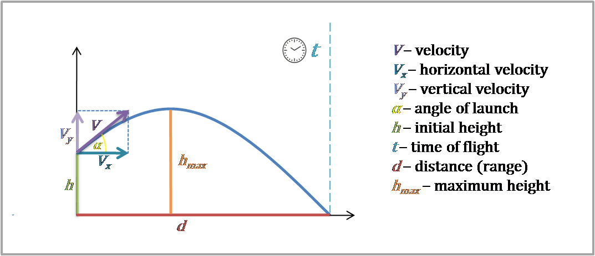
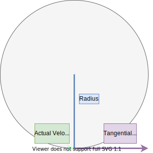
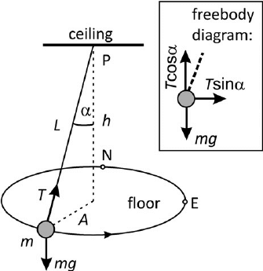
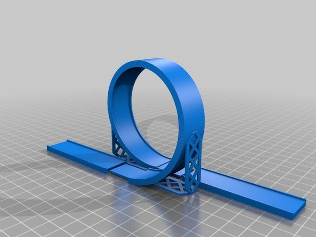



---

##### IQ: How can models that are used to explain projectile motion be used to analyse and make predictions?

## Projectile Motion

A projectile is an object that cannot move by itself, moving freely under the force of gravity.

*   There is no other force other than gravitational force acting on the object
*   Net force of the projectile is gravitational force (mg), weight
*   Objects experience:
    *   Vertically downward force of 9.81 N/kg
    *   Vertically downward acceleration of 9.81 m/s2

The projectile moves in a parabolic arc as the vertical gravitational force causes it to deviate from its otherwise linear path.

According to Newton’s 2nd law (F = ma), the projectile’s horizontal component has constant velocity (no acceleration) as there is no external force acting on it (the horizontal component is independent of the vertical component), it remains moving due to inertia (Newton’s 1st Law).

Force is always downwards, but direction of motion varies.

Whether an object is projected or just dropped, it will still fall at the same rate

 

**Assumptions of our model**

*   Constant vertical acceleration due to gravity
*   Curvature of Earth ignored
*   No air resistance



### Analysing Projectile Motion

 Projectile motion is 2D motion. To analyse:

1. Break up motion into vertical and horizontal components
2. The two components are completely independent of each other thus, they can be treated separately
3. There is no acceleration in the horizontal direction as gravity only acts vertically
4. Find vertical and horizontal components
   *   Y components: $u\sinθ$,$ v\sinθ$, a = 9.81ms-2, vertical height
   *   X components: $u\cosθ$, $v\cosθ$, a = 0, range
5. Find time, as time is the same for both components

<table>
  <tr>
   <td>
<strong>X DIrection</strong>
   </td>
   <td><strong>Y Direction</strong>
   </td>
  </tr>
  <tr>
   <td><strong>vx = ux </strong>where v is x component of final velocity, u is x component of initial velocity (m/s)
   </td>
   <td><strong>vy2 = uy2+ 2ay∆sy</strong> where v is y component of final velocity, u is y component of initial velocity (m/s), a is vertical acceleration of 9.81ms-2, s is y component of displacement
   </td>
  </tr>
  <tr>
   <td><strong>∆sx = uxt</strong> where s is x component of displacement (m), t is time (s)
   </td>
   <td><strong>∆sy = uyt +1/2 ayt2</strong> where u is y component of initial velocity (m/s), a is vertical acceleration of 9.81ms-2, s is y component of displacement, t is time (s)
   </td>
  </tr>
  <tr>
   <td>
   </td>
   <td><strong>vy = uy + ayt</strong> where v is y component of final velocity, u is y component of initial velocity (m/s), a is vertical acceleration of 9.81ms-2, t is time (s)
   </td>
  </tr>
</table>

### Special cases

*   If the projectile launches and lands at the same height, the initial and final angle is the same magnitude – only one is an angle of elevation and the other an angle of depression.
*   If there is no angle of launch, velocity in the y direction is zero while velocity in the x direction is the same as initial velocity

### Types of Questions

#### No initial vertical velocity component/half-flight/no angle given

*   Initial velocity = horizontal velocity = constant
*   Vertical velocity is initially zero but increases as object falls (vy = uy + at)

#### No initial vertical displacement given

*   Initial horizontal velocity =ucosθ = constant
*   Initial vertical velocity = usinθ
*   Sy = 0
*   Vertical velocity at max. height = 0
*   Launch angle = landing angle
*   Angle of projection for max. range = 45o

#### Projectile fired at an angle above ground

*   Initial horizontal velocity =ucosθ = constant
*   Initial vertical velocity = usinθ
*   Vertical velocity at max. height = 0
*   Angle of projection for max. range = 45o

#### Half flight projectile motion

*   Downward acceleration = gravity
*   Vertical velocity increases constantly
*   Horizontal velocity is a constant

#### Find the...

*   time of flight (half-flight and full-flight)
    *   Influenced by:
        *   Initial vertical velocity ONLY IF LAUNCH ANGLE > 0 – increase in initial velocity $\rightarrow$ longer time of flight (direct)
        *   Launch angle – higher launch angle $\rightarrow$ longer time of flight (direct)
        *   Vertical displacement – higher vertical displacement $\rightarrow$ longer time of flight (direct)
*   initial velocity (velocity immediately after launch)
*   launch angle
*   maximum height
    *   Launch angle – higher launch angle $\rightarrow$ higher maximum height (direct)
    *   Initial vertical velocity i.e.: faster it is projected upwards the higher it goes, regardless of the horizontal motion
    *   Vertical displacement – higher vertical displacement $\rightarrow$ higher maximum height (direct)
*   final velocity (velocity just before it hits ground)
*   velocity, height, distance at a point in time
*   launch height
*   horizontal range of the projectile
    *   Influenced by
        *   Launch angle – increase in angle $\rightarrow$ increase in range UP TO 45o THEN increase in angle $\rightarrow$ decrease in range
        *   Initial velocity – increase in initial velocity $\rightarrow$ increase in range (direct)
        *   Vertical displacement – increase in vertical displacement $\rightarrow$ increase in range (direct)

- The trajectory of a projectile is determined by its initial velocity (direct relationships) and forces that act on it as well as air resistance.

- y = usinθ $\rightarrow$ both are dependent on initial velocity and angle between projectile and the ground.

- x = ucosθ

The maximum height for a projectile is the highest point of the arc given by: launch height – usin2x/2g

Flight time for a projectile with same launch and landing height is given by: - 2usinx/g and final velocity will be equal to initial velocity

#### [Equations of Motion](/post/kinematics/#suvat-equations)

## Charged Particles Projected into Electric Fields

<table>
  <tr>
   <td><strong>Similarities to projectile dropped in G field</strong>
   </td>
   <td><strong>Differences to projectile dropped in G field</strong>
   </td>
  </tr>
  <tr>
   <td>If dropped, accelerates uniformly parallel to field lines

If projected, will follow parabolic trajectories in an uniform field
   </td>
   <td>Different masses will accelerate at different rates unlike in a gravitational field where all masses accelerate at the same rate

Positive and negative charges will accelerate in opposite directions

Exact curve of a projectile in an electric field is dependent on velocity, charge and mass, unlike in a gravitational field where all masses if launched exactly the same will follow the same curve
   </td>
  </tr>
</table>

### Factors that influence Projectile Motion

*   Range
    *   Higher initial velocity $\rightarrow$ larger range (direct)
    *   Larger charge $\rightarrow$ smaller range (inverse)
    *   Larger mass $\rightarrow$ larger range/less deflection (direct)
    *   Higher voltage $\rightarrow$ smaller range (inverse
*   Acceleration
    *   Larger charge $\rightarrow$ greater acceleration (direct)
    *   Smaller mass $\rightarrow$ greater acceleration (inverse)
    *   Higher voltage $\rightarrow$ greater acceleration (direct)

Like projectiles, y and x velocity components can be found. Equations of motion can be used.

$E = V/d$ (capital V is voltage) distance between plates?

##### IQ: Why do objects move in circles?

## Circular Motion

An object travelling a circular pathway at constant tangential speed is undergoing uniform circular motion (UCM).

### Characteristics of UCM

*   Motion along circular path of radius _r_
*   Tangential speed _v_ is constant hence, period _T_ is constant
*   Angular velocity (rate of change of angle) 𝜔 is constant
*   Linear velocity is not constant as direction is continually changing. Linear velocity is perpendicular to net force of the object’s rotation
*   Centripetal acceleration (ac) is directed towards the centre
*   Net force (Fc) towards the centre of the circle

The net force of an object moving in UCM is directed towards the centre and is called centripetal force and is given by:

Fc = mv2/r  where Fc is centripetal force (N), m is mass of object in circular motion (kg), v is velocity/orbital velocity of the object (m/s), r is radius of the circle (m)

### Factors that influence circular motion

*   Centripetal force
    *   Orbital velocity
        *   There is a direct square relationship. Increase in orbital velocity $\rightarrow$ squared increase in centripetal force acting on/required to keep object in UCM increases as well
    *   Mass
        *   Mass increase $\rightarrow$ centripetal needed increases (direct)
    *   Radius
        *   Increase in radius $\rightarrow$ decrease in centripetal force needed/acting on it (inverse)

### Formulae

*   T = 1/f where T is period (time to complete one revolution) (s), f is frequency (Hz)
*   𝜔
    *   𝜔 = ∆θ/∆t where 𝜔 is angular velocity (rad/s), θ is angle (rad), t is time (s)
    *   𝜔 = 2𝜋f where f is frequency (Hz)
    *   𝜔 = ∆s/rt where s is arc length (m)
    *   𝜔 = v/r where v linear velocity (m/s), r is radius (m)
*   v = 2𝜋rf = r𝜔 = 2πr/T
       *   v = $\frac{\sqrt{GM}}{r}$ where v is orbital velocity (m/s), G is universal gravitational constant (6.67 x 10-11 Nm2kg-2) (average amount of gravity experienced in the universe) , M is mass of central object (kg), r is orbital radius (m) ***NOT ON FORMULA SHEET***
*   ac = r𝜔2 = v2/r (derived from F = ma and Fc = mv2/r)
    *   For satellites:
*   Fc = mv2/r = mr𝜔2 = mac where m is mass (kg)
    *   For satellites:
        *   Fc = GMm/r2 where m is mass of spinning object (kg)

## Conditions for an Object to Execute Circular Motion

As the object is accelerating, there must be a net force acting on the object given by Newton’s 2nd Law (F=ma) directed towards the centre.

Fnet = Fc = mv2/r

Examples:

<table>
  <tr>
   <td><strong>Situation</strong>
   </td>
   <td><strong>Force providing Fc</strong>
   </td>
   <td><strong>Condition</strong>
   </td>
  </tr>
  <tr>
   <td>Car driving around a horizontal circular bend
   </td>
   <td>Friction between the tires and the road <em>f</em>
   </td>
   <td><em>f</em> =mv2/r
   </td>
  </tr>
  <tr>
   <td>Ball swinging on a string
   </td>
   <td>Tension in the string towards axis of rotation <em>T</em>
   </td>
   <td><em>T</em> = mv2/r
   </td>
  </tr>
  <tr>
   <td>Satellite orbiting a planet
   </td>
   <td>Gravitational force between satellite and planet <em>FG</em>
   </td>
   <td><em>Fg</em> = mv2/r
   </td>
  </tr>
</table>

If the centripetal force and details of the motion **do not satisfy Fc = mv2/r**, then the object **will not follow UCM **and instead follow a different path:

<table>
  <tr>
   <td><strong>Situation</strong>
   </td>
   <td><strong>Condition</strong>
   </td>
   <td><strong>Motion</strong>
   </td>
  </tr>
  <tr>
   <td>Car driving around a horizontal circular bend
   </td>
   <td>Road is slippery, there is not enough friction <strong><em>f</em> &lt; mv2/r</strong>
   </td>
   <td>Car slides out of the turn and travels on a linear pathway (tangent to the circle) d/t inertia
   </td>
  </tr>
  <tr>
   <td>Ball swinging on a string
   </td>
   <td>String is cut so no tension in the string, <strong><em>T </em>= 0 &lt; mv2/r</strong>
   </td>
   <td>Ball flies off and travels on a linear pathway (tangent to the circle) d/t inertia
   </td>
  </tr>
  <tr>
   <td>Satellite orbiting a planet
   </td>
   <td>Satellites motion does not satisfy conditions of circular motion, <em>Fg</em> ≠ mv2/r
   </td>
   <td>Satellite follows elliptical orbit
   </td>
  </tr>
</table>

The centripetal force is always perpendicular to the direction of velocity and has constant strength despite changing in direction. The popular term ‘centrifugal force’ actually refers to the force of inertia the spinning object exerts on the wall or rope as per Newton’s 1st Law which feels like an outward force.

Acceleration and force occur in the same direction. Centripetal acceleration occurs due to a constantly changing direction NOT because of the velocity, as magnitude of the velocity does not change.

RPM $\rightarrow$ rad/s by converting minutes to seconds by dividing by 60 and converting revolutions to radians by multiplying by 2π

km/hr $\rightarrow$ m/s by dividing by 3.6

### Analyse forces on an object executing uniform circular motion

1. Identify forces acting on the object. Draw a free body diagram.
2. Determine direction of acceleration. For UCM, acceleration is always towards centre of the circle
3. Decompose the forces into parallel and perpendicular components (to acceleration)
4. Apple Newton’s 2nd Law to components and find the unknown
   1. In the direction of acceleration there is a net force: Fnet = mv2/r
   2. Perpendicular to acceleration, a = 0 so Fnet = 0
   3. Often find ac first

Uniform circular motion can be applied to different systems. Three common systems are: car moving around a corner on a flat and banked road and mass on a string (conical pendulum).

#### Cars moving around horizontal circular bends

Friction supplies the centripetal force to make a car go around a bend on a flat surface thus, _f_ = Fc = mv2/r. The normal force and friction force are on all 4 tires. Therefore, when a car corners on a flat road we can model the bend as part of a circle.

##### Forces acting

*   Lateral frictional force between road surface and tires (_f_)
*   Normal force (N)
*   Weight force (w)

The car does not accelerate vertically up thus, N = w. Lateral frictional force can be influenced by turning the steering wheel which causes the front wheels of the car to angle.

##### Possible Situations

<table>
  <tr>
   <td><strong>Fc</strong>
   </td>
   <td><strong>Motion</strong>
   </td>
  </tr>
  <tr>
   <td>F = mv2/r
   </td>
   <td>UCM
   </td>
  </tr>
  <tr>
   <td>F > mv2/r
   </td>
   <td>Car moves towards the centre of the circle. Radius decreases so car turns more sharply.
   </td>
  </tr>
  <tr>
   <td>F &lt; mv2/r
   </td>
   <td>Car moves away from the centre of the circle. Radius increases so car turns more gently.
   </td>
  </tr>
</table>

#### Why are we learning this?

The ability of the car (driver) to turn a corner depends on how sharp it is (r) and how fast the car is travelling (can be controlled). Slowing down, we can turn a sharper corner (smaller radius).

Due to a direct square relationship, increasing velocity by x1 results in x4 of the Fc needed to keep the body in UCM. Thus, the faster the car is going, the greater the frictional force required. There is a maximum frictional force that the road can exert on tires thus, slowing down is vital. RMS indicates suggested speeds for corners.

Friction provided reduces when there is water, oil or worn tires.

#### Cars on banked tracks (ignore friction)

A banked road is a road that is tilted into the centre of the turn or circular path. This results in a net force that accelerates the car in the direction of the corner, helping vehicles travel at higher speeds around corners without skidding. Since the car is moving around a corner, we can model this as an arc of a circle thus, Fnet = Fc. This situation looks similar but, **is different to an inclined plane** question in that the normal force is the **HYPOTENUSE** (mg = Ncosθ) rather than a vertical side (N = mgcosθ) **i.e. the triangles are different.**

#### Why is this?

On an inclined plane as the angle increases, the normal force decreases as more and more of the weight is supported by friction. But, on a banked curve as the slope increases, the normal force needed increases as the centripetal force increases e.g. a racetrack this corresponds to the steepest banked curves being at the sharpest/tightest corners. The sharper the corner the more centripetal force is required to make the turn, requiring more banking and more normal force.

#### Forces acting

*   Normal force (N) - tilted towards centre and    component towards centre contributes to Fc
*   Weight force (w)

If the car is turning at the design speed, the **horizontal component of the normal force provides Fc** rather than friction (_f_)

### Design Speed

Design speed is the speed required for the car to not slide up or down the banked road. It requires a balance between forces up the bank and forces towards the centre.

If the speed is too high then the car will start moving up the bank. If the car is too slow it will slide towards the centre.

It is given by: √(rgtanθ) NOT ON FORMULA SHEET

### Conical Motion

The string is at an angle θ from the vertical. The mass swings in a circular trajectory, drawing a circle with radius (r) at distance (h) below the mount. The horizontal component of tension provides the centripetal force.

#### Forces acting

*   Tension of the string T = mv2/r
*   Weight force (w = mg) down

#### Effects of increasing tension

*   Vertical component of T remains constant $\rightarrow$balances downward weight force $\rightarrow$ angle increases (direct)
*   Horizontal component increases $\rightarrow$ centripetal force increases $\rightarrow$ angle increases (direct)

#### Total energy and work done on object undergoing UCM

Kinetic energy (K) = ½ mv2

When an object is undergoing UCM its magnitude of velocity (v) is constant. Thus, kinetic energy is also constant.

## Non-Uniform Circular Motion

Apparent weight is equal to the normal force (N or Fn) acting on you. Due to Newton’s 3rd Law where each force has an equal and opposite reactionary force, the bigger the normal force the heavier you feel. Using Newton’s 2nd law: Fnet = mac = mv2/r thus, net force is providing centripetal force

Thus, at the top of the dip you _feel_ lighter as the normal force (N or FN) on you has decreased and at the bottom you _feel _heavier as normal force increases.

[https://www.youtube.com/watch?v=b-FAfNaiZ6M](https://www.youtube.com/watch?v=b-FAfNaiZ6M) https://www.youtube.com/watch?v=TiOo0b-gwyI

#### Loop de Loop

As per Newton’s 2nd law,

Fnet = ma thus, in the radial direction:

Fnet = mv2/r

At the top, both mg and N are acting in the same direction.

Top: Fnet = mg + N = mv2/r = mg + N $\rightarrow$ N = mv2/r – mg thus, you _feel_ lighter

Bottom: Fnet = N – mg = mv2/r = N – mg $\rightarrow$ N = mv2/r + mg thus you _feel_ heavier

## Mechanical Energy

Mechanical energy = kinetic energy (K) + potential energy (U)

Mechanical energy is always conserved unless work is done by an external force. Sometimes energy is transformed light, heat, sound.

K before + U before = K after + U after

## Work

Work is the transfer of energy from one object to another or the transformation of energy from one form to another.

A force does work on an object when it causes a displacement in the direction of the force. W = Fs (if force parallel) = Fscosθ (force and displacement vectors) where s is displacement )m), F is force (N) and θ is angle between force and displacement

## Torque

To make an object rotate a torque (τ) needs to be applied (UCM). A force acts to provide this turning effect.

A torque is due to a force acting on an object at a distance (r) from the pivot point (axis of rotation).

τ = r⊥f (turning point to end of lever) or rfsinθ where r is lever arm length (m), f is force (N) and θ is angle between level arm and force applied

Unit is Nm, newton metres, theta is angle between force and the lever

An object can orbit (external axis) i.e. earth orbiting the sun or spin (internal axis) i.e. earth spinning on axis

Torque is proportional to and causes angular acceleration in rotational motion:

$\color{orange}{\frac{\Delta\omega}{t}\propto\tau}$

Torque is applied whenever there is a force acting tangentially to rotational motion:

*   Torque will **increase angular velocity** if tangential component of the force is in the **same direction **as velocity
*   Torque will **decrease angular velocity** if tangential component of the force is in the **opposite direction** as velocity

An object in rotational equilibrium has no net external torque. It may mean that the object is not rotating or rotating at constant angular velocity.

## Motion in Gravitational Fields

##### IQ: How does the force of gravity determine the motion of planets and satellites?

A gravitational field is an area or region where an object with mass experiences a force of attraction towards a larger mass. Earth’s gravitational field strength changes with radius: g = 1/r2

The Earth’s gravitational field is given by: g = GME/rE2 where g is gravitational field strength, G is universal gravitational constant, ME is mass of the Earth, r is distance from the centre of the earth, rE is radius of the earth.

##### Derivation

Fg = mg

g =fg/m = GMm/r2 x 1/m = GM/r2 therefore, g = GM/r2 

note: when a question specifies altitude, to find radius (r) you must add the radius of the earth.

### Factors affecting gravitational field strength

*   The larger the mass of the planet (M), the greater the gravitational force (direct)
*   The larger the r, the smaller the g (inverse square) decreases by a factor of 2

Acceleration due to gravity is equal is magnitude of gravitational field strength.

## Newton’s Law of Universal Gravitation

Newton’s Law of Universal Gravitation allows us to calculate the amount of gravitational attraction between two objects of mass. It states that every object in the universe attracts another object with a force directly proportional to the product of their masses and inversely proportional to the square of the distance from their centres. It is given by:

F = GMm/r2 where F is gravitational force (N), G is the universal gravitational constant (6.67 x 10 -11 Nm2 kg-2), M is the mass of the central object (kg), m is the mass of orbiting object (kg), r is radius (distance of separation centre to centre, radius of orbit) (m)

### Predicting gravitational field strength at any point in a g field

## Orbital motion of Planets and Satellites

### Kepler’s Law of Planetary Motion

Johannes Kepler student of Tycho Brahe (royal astronomer to King of Denmark) formed three empirical laws from years of recording and observing the trajectories of planets and stars.

#### Law of Ellipses

Each planet moves in an ellipse (oval) with the sun at the foci (sun is closer to one side) causing, summer and winter. Kepler identified the orbits of satellites as slightly elliptical.

#### Law of Areas

The radius line of each planet sweeps out equal area in equal time. Planets as they travel behind the sun travel slightly faster as they are covering a longer arc length whereas, planets travel slower when further away from the sun as they are covering a shorter arc length. This is due to the sun not being centred. The time to travel from Q to P = time to travel from S to R therefore, area QOP = area ROS.

#### Law of Periods

Kepler’s third law was calculated in 1619 from observations of planetary motion by Tycho Brahe. Kepler found there is a relationship between period (T) of a satellite’s orbit and its radius (r). The square of the period (T) of the planet is proportional to the cube of their average distance (r) from the sun as distance varies due to elliptical orbit. The law is quantified by:

r3/T2 = GM/4π2 where r is orbital radius centre to centre (m), T is period of orbit (time for planet to go around once (s), G is gravitational constant, M is mass of central object (kg).

Asserts that the ratio r3/T2 = k is the same for all planets. 4π2/GM is a constant for all satellites orbiting around mass M

T2earth/r3earth is proportional to T2mars/r3mars

#### Applications

The orbital motion of planets and artificial satellites (launched by humans, orbiting larger mass eg: GPS satellite) can be modelled and explained using gravitational fields. We can calculate star masses, orbital velocity or orbital period of these planets and artificial satellites.

To answer these questions, we combine UCM with Newton’s Law of Universal Gravitation.

In orbits, gravitational force provides the centripetal force hence:

F = GMm/r2 = mv2/r = 4π2rm/T2 = mg    link between them

Thus,

GMm/r2 = mv2/r

GMmr/r2 = mv2

v2 = GMmr/mr2

v2 = GM/r

v = √GM/r which can be used to find centripetal acceleration:

ac = v2/r = GM/r2

or to calculate mass (M) of stars from orbital period (T) and radius of planets orbiting a star (r) as 2πr/T gives linear velocity.

#### Mass of central object (M): from Kepler’s Third Law in kg

r3/T2 = GM/4π2, where M = 4π2r3/GT2

#### Mass of orbiting object (m)

F = GMm/r2 = mv2/r, m = Fcr/v2 or Fcr2/GM $\rightarrow$ if you don’t have orbital velocity

#### Orbital period (T)

r3/T2 = GM/4π2

T = √4π2r3/GM or 2πr/v

#### Orbital radius (r)

r3/T2 = GM/4π2

r = ∛GMT2/4π2, where r = orbital radius (m) = earth’s radius + altitude

#### Orbital velocity (v)

v = 2πr/T or v = √GM/r or v = √Fcr/m

#### Gravitational Potential Energy in Orbit

Potential energy is defined as the work done by an upward external force on an object as it is lowered from one point to another at constant speed. It is given by:

U = -GMm/r where U is potential energy (J), G is universal gravitational constant, M is mass of central mass (kg), m is mass of smaller mass (kg), r is distance centre to centre between the two masses (m)

Negative means the gravitational force is attractive. If you want to move two objects further apart you have to do positive work aka add energy by applying a force opposite to the field. Gravitational potential energy of two masses is proportional to the product of the masses and inversely proportional to the separation. It is also negative aka attractive.

Gravitational potential energy is defined by the work done in moving an object against the gravitational field in moving a mass from surface of earth to a height (h) above. It is given by:

U = mgh where m is mass (kg), g is gravitational field strength or acceleration, h is height (m). This is derived from W (j) = Fs (N) = mgs(h) height is displacement.

Comparison:

<table>
  <tr>
   <td>
   </td>
   <td><strong>U = mgh</strong>
   </td>
   <td><strong>U = -GMm/r</strong>
   </td>
  </tr>
  <tr>
   <td><strong>Define</strong>
   </td>
   <td>work done in moving an object against the gravitational field in moving a mass from surface of earth to a height (h) above
   </td>
   <td>The work done by an upward external force in

lowering a mass from infinity to a distance (r) from

the centre of the Earth without acceleration.
   </td>
  </tr>
  <tr>
   <td><strong>When is it used?</strong>
   </td>
   <td>Near the earth’s surface h &lt;< rE so g is constant
   </td>
   <td>Used for large height changes when r > rE or far from Earth’s surface
   </td>
  </tr>
  <tr>
   <td><strong>As r increases…</strong>
   </td>
   <td>U approaches infinity
   </td>
   <td>U approaches 0
   </td>
  </tr>
  <tr>
   <td><strong>When U = 0</strong>
   </td>
   <td>At surface of the Earth
   </td>
   <td>Infinite distance away from the centre of the Earth
   </td>
  </tr>
</table>

### Total Energy of a Planet in Its Orbit

Total energy is equivalent to mechanical energy which is K + U. Kinetic energy of a satellite in orbit is given by:

K = ½mv2 = ½m x (√GM/r)2 = GMm/2r

Thus, total energy is given by,

E = K + U = -GMm/r + GMm/2r = -GMm/2r NOT ON FORMULA SHEET

#### Near Earth and Geostationary Orbits

Satellites in orbit around the Earth are classified as low, medium or high orbit.

1. **Low Orbit (180km – 2000km) altitude**

   Most common satellite orbit (Hubble telescope, 540km or international space station, 400km, spy, military, mapping satellites).

- Orbital Period (T)= approx. 90min but 80-120min

- Whole of the Earth’s surface can be quickly covered

2. **Medium Orbit (2000km – 36000km) altitude**

   Used by global positioning systems (GPS)

- Orbital Period (T) = approx. 3hrs but 3-22hrs

3. **High Orbit (36000+ km)**

   Used by communications satellites, eg: Optus, deep space weather imaging etc…

> A Geostationary satellite has a period (T) of 24hrs (with the Earth thus, ‘stationary’ as it stays above the same point on Earth’s surface if at equator). Used for communications eg: satellite phones, TV.

> Geo-synchronous is when satellite spins as same rate of Earth’s spin. Thus, it has the same rotational period but, orbit may not be perfectly circular and may have an orbital inclination.

> A Geostationary satellite is a special case of a geo-synchronous satellite where the orbit is circular and orbital inclination is 0.

## Energy Changes that Occur when Satellites Moves Between Orbits

When an object moves from a high orbit to a lower orbit, it moves through an increasing G field strength as the gravitational force (g or Fg) on the object increases as it approaches Earth. The change in gravitational U is given by: ∆U = Ufinal – Uinitial in joules.

**When one object moves within the gravitational field of a second object:**

<table>
  <tr>
   <td>
   </td>
   <td><strong>Moves with the field</strong>
   </td>
   <td><strong>Moves against the field</strong>
   </td>
  </tr>
  <tr>
   <td><strong>Isolated</strong>
   </td>
   <td>Work is done by the field

potential energy decreases while kinetic energy increases
   </td>
   <td>Work is done on the field

U increases, K decrease
   </td>
  </tr>
  <tr>
   <td><strong>Open or Closed</strong>
   </td>
   <td>Work is done by external agent and by the field

U decreases, K increases
   </td>
   <td>Work done by external agent and on the field,

U increases, K either (depends which does more work)
   </td>
  </tr>
</table>

Gravitational U is a binding energy. To escape from earth's gravitational field, given you have mass m you must do work that’s equal or above gravitational U.

Work is given by:

W = Fs = Fc x s = GMm/r2 x r = GMm/r

### Escape Velocity

Escape velocity is when a rocket has enough kinetic energy (K) to escape the Earth’s gravitational field. Escape velocity is the minimum velocity for an object at the surface of Earth to escape to space and not be pulled back. Earth’s escape velocity is 11200 m/s MEM.

For a satellite to escape gravitational field,

K = U (at a minimum)

U = -GMm/r

½mv2 = -GMm/r

v2 = -2GM/r

Thus, minimum velocity for satellite to _make it out alive_ is given by,

vescape = √2GM/r NOT ON FORMULA SHEET where vescape is escape velocity (m/s), M is mass of central body (kg), G is universal gravitational constant, r is orbital radius (centre to centre) (m)

note: do not confuse escape velocity with orbital velocity

#### Factors that influence vescape

*   Smaller radius (r) $\rightarrow$ higher escape velocity needed (inverse square root)
*   Larger central mass (M) $\rightarrow$ higher escape velocity needed (direct square root)
*   Escape velocity IS INDEPENDENT of mass of the launched object i.e. regardless of how heavy the object is, the escape velocity will be the same for all objects. Satellites are typically launched from close to the equator towards the east (same direction of Earth’s rotation so it can contribute to the kinetic energy of the rocket).