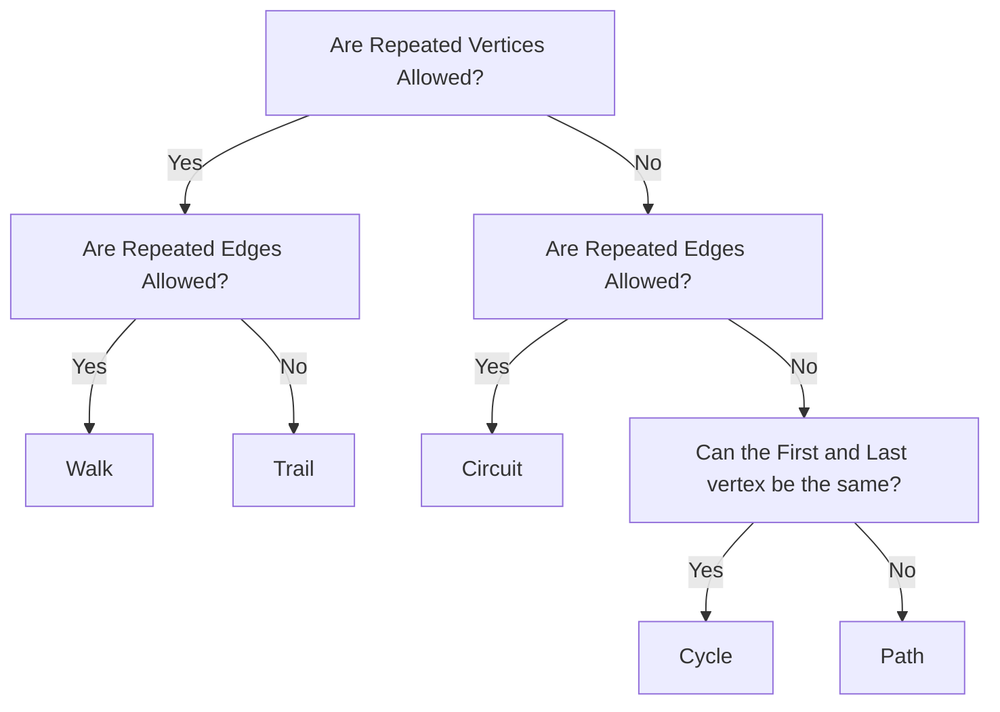

---
# Page title
title: Testing Page

# Title for the menu link if you wish to use a shorter link title, otherwise remove this option.
linktitle: "Testing Page"

tags: [Testing]

# Page summary for search engines.
summary: "**🔜 Work in Progress** TESTING FOR THE RENDER ENGINE."

# Date page published
date: 2021-08-02

# Comment the next line out
#draft: true
# Academic page type (do not modify).
type: book
math: true
# Position of this page in the menu. Remove this option to sort alphabetically.
weight: 999
diagram: true
---



This is a testing page for the CMS and site render engine. If stuff breaks, we check this page to see if it's a site-wide issue.

## Header 2

### Header 3

#### Header 4

##### Header 5

###### Header 6

## Formatting

*This text is in Italics*

**This text is bold**

***This text is bold and italicised***

~~This text is crossed out~~

> This text should be a block quote.

This text should be highlighted.



contents of the spoiler



### Cross-referencing

[external link](https://core.pks.ai/?utm_source=hscone&utm_campaign=testing-page)

This text has a footnote[^1].



### Callouts

{}
Note callout
{}

{}
Info callout
{}

{}
Warning callout
{}

{}
Success callout
{}

## Lists

1. Numbered list
   1. Sub-entry 1
   2. Sub-entry 2
2. Original level

- Unordered list
  - Sub-level 1
    - Sub-level 2
  - Sub-level 1
- Original level

### Todo List

- [x] checked-off item
  - [x] checked-off sub-item
  - [ ] un-checked sub-item
- [ ] unchecked item

## Embeds

Font Awesome Terminal icon  with a heart emoji :heart:

This is an audio file:



This is a youtube video:



This is a line chart using Plotly:



This is a mermaid plot:

### Math ($\LaTeX$)

$$\begin{gather*}\bbox[5px, border: 2px solid orange]{\bbox[5px, border: 2px solid red]{\text{Strong BL Acid}}\text{ + Water}}\rightarrow\bbox[5px, border: 2px solid pink]{\text{Hydronium +}\bbox[5px, border: 2px solid green]{\text{Weak BL Base}}} \\\\ \bbox[5px, border: 2px solid orange]{\bbox[5px, border: 2px solid red]{\ce{HCl(aq)}} \ce{+H2O(l)}}\ce{->}\bbox[5px, border: 2px solid pink]{\ce{H3O+(aq) +}\bbox[5px, border: 2px solid green]{\ce{Cl-(aq)}}} \\\\ \bbox[5px, border: 2px solid orange]{0\text}\end{gather*}$$

| Tables        |      Are      |  Cool |
| ------------- | :-----------: | ----: |
| col 3 is      |    Cringe     | $1600 |
| col 2 is      | left aligned? |   $12 |
| zebra stripes |   are neat    |    $1 |

---

[^1]: This is a footnote.
